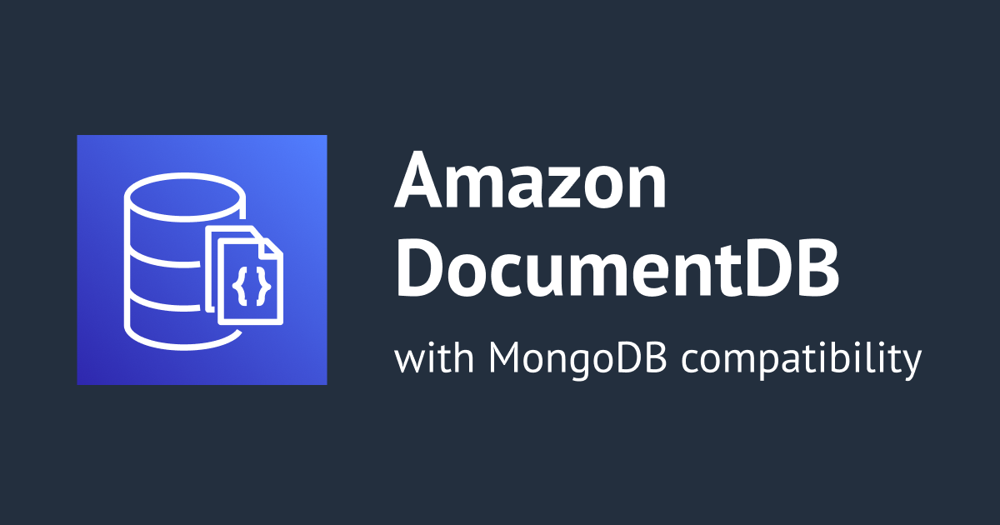
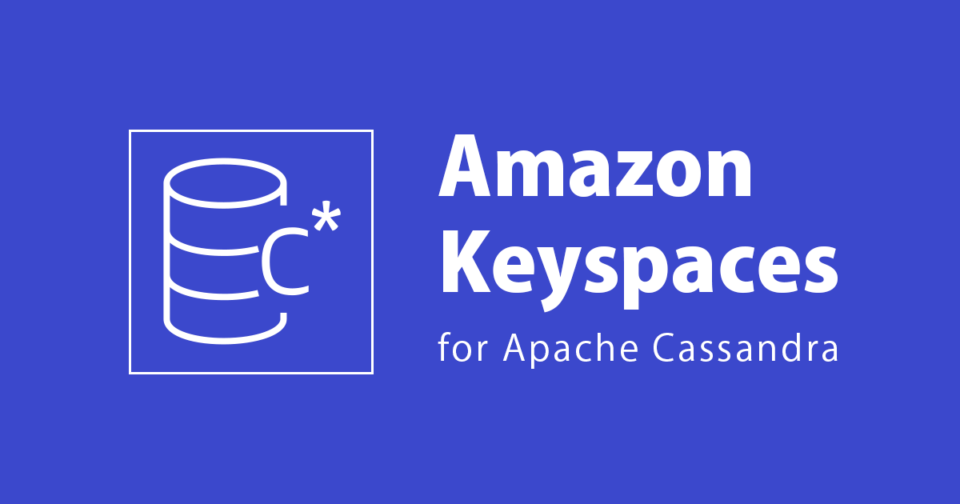
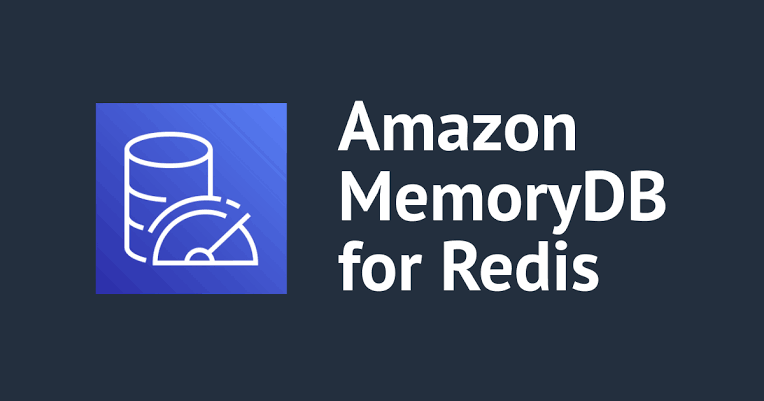
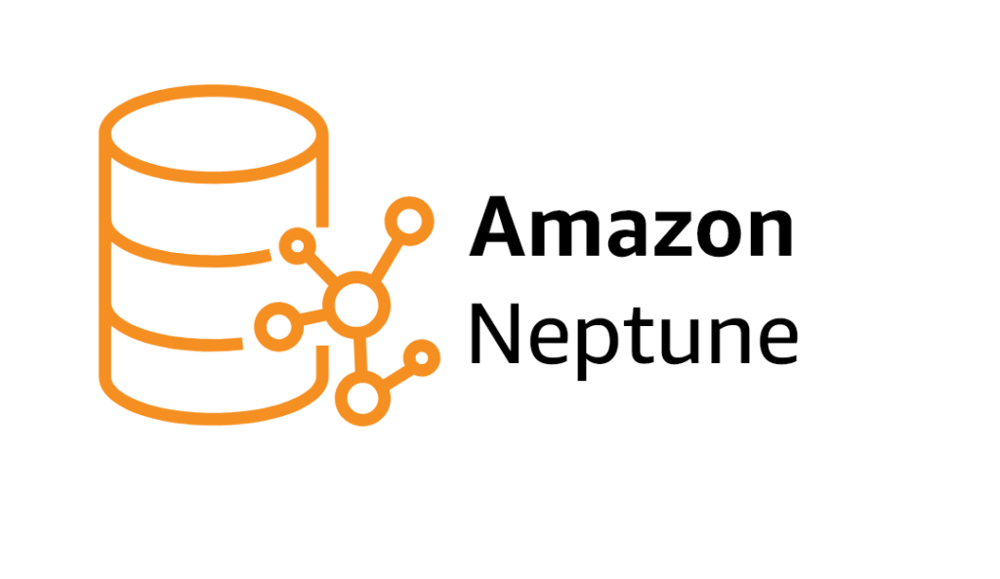
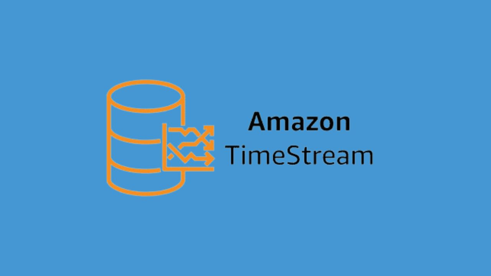
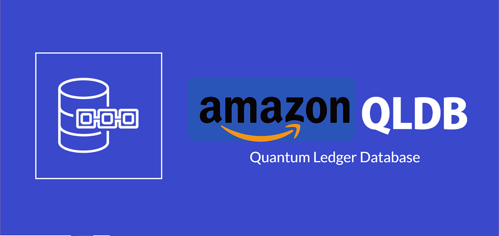

# 🧠 Advanced AWS Database Services

> Research notes on AWS's purpose-built database services beyond RDS/Aurora/DynamoDB — when each one exists, why it exists, and when to actually reach for it.

---

## 📋 Overview

AWS doesn't ship one database for every job — it ships **purpose-built engines**, each optimized for a specific data shape and access pattern. Picking the right one avoids two failure modes: paying for capability you don't need, or fighting a database that was never designed for your workload.

This note covers **6 advanced/purpose-built AWS database services**:

| # | Service | Category |
|---|---------|----------|
| 1 | 🍃 Amazon DocumentDB (with MongoDB compatibility) | Document database |
| 2 | 🔷 Amazon Keyspaces (for Apache Cassandra) | Wide-column / Cassandra workloads |
| 3 | ⚡ Amazon MemoryDB for Redis | In-memory database |
| 4 | 🕸️ Amazon Neptune | Graph database |
| 5 | 📈 Amazon Timestream | Time-series database |
| 6 | 🔒 Amazon QLDB (Quantum Ledger Database) | Ledger database |

---

### Task 1 — 🍃 Amazon DocumentDB (with MongoDB compatibility)

**Type:** Document database

A fully managed, MongoDB-compatible document database. You keep your existing MongoDB drivers, application code, and tooling — AWS handles provisioning, patching, backups, and scaling underneath.

| Aspect | Detail |
|---|---|
| Data model | JSON-like documents (BSON) |
| Compatible API | MongoDB |
| Compute/Storage | Decoupled — scale independently |
| Best for | Content management, catalogs, user profiles, existing MongoDB workloads |
| Not ideal for | Greenfield apps with no MongoDB dependency (DynamoDB is often more native) |

> 💡 **Note:** DocumentDB version 3.6 reaches end of standard support on March 30, 2026, after which Extended Support is available for three additional years. A new query planner introduced in October 2025 brings up to 10x performance improvements — worth checking your engine version before benchmarking.

---

### Task 2 — 🔷 Amazon Keyspaces (for Apache Cassandra)

**Type:** Wide-column / Cassandra-compatible database

A serverless, fully managed Cassandra-compatible database. You run Cassandra workloads using existing Cassandra application code and tooling, without provisioning or managing any servers.

| Aspect | Detail |
|---|---|
| Data model | Wide-column (tables, partitions, clustering keys) |
| Compatible API | Apache Cassandra (CQL) |
| Scaling | Serverless — automatic up/down scaling |
| Best for | High-write workloads, time-series-adjacent data, teams migrating off self-managed Cassandra |
| Not ideal for | Teams not already on Cassandra |

> 🆕 **Recent feature:** Keyspaces now supports **logged batches** — atomic, all-or-nothing multi-statement writes — for Cassandra-compatible workloads that need transactional guarantees across multiple rows.

---

### Task 3 — ⚡ Amazon MemoryDB for Redis

**Type:** In-memory database

A Redis-compatible, durable, in-memory database service built for ultra-fast performance, purpose-built for microservices architectures. Unlike a pure cache, it's designed to be a **primary database**, not just an accelerator in front of one.

| Aspect | Detail |
|---|---|
| Latency | Microsecond reads, single-digit millisecond writes |
| Durability | Multi-AZ, distributed transactional log |
| Compatible API | Redis |
| Best for | Microservices needing both speed *and* durability — replaces cache + durable DB combo |
| Throughput | Processes more than 13 trillion requests per day and over 160 million requests per second across the fleet |

---

### Task 4 — 🕸️ Amazon Neptune

**Type:** Graph database

A fully managed graph database purpose-built for **highly connected data** — the kind relational tables struggle to query efficiently once relationships get deep (friend-of-a-friend, fraud rings, recommendation chains).

| Aspect | Detail |
|---|---|
| Query languages | Gremlin, SPARQL, openCypher |
| Latency | Millisecond traversal across billions of relationships |
| Durability | 6x data replication across 3 AZs (like Aurora) |
| Best for | Social networks, fraud detection, recommendation engines, knowledge graphs |
| Not ideal for | Standard relational/document workloads with no real graph relationships |

> 🤖 **AI angle:** Neptune Analytics now supports vector similarity search alongside graph traversal, which means a single engine can do nearest-neighbor vector lookups *and* relationship traversal — useful for retrieval-augmented generation (RAG) over connected data.

---

### Task 5 — 📈 Amazon Timestream

**Type:** Time-series database

Purpose-built for data that's inherently ordered by time — sensor readings, metrics, financial ticks, telemetry. As data grows, Timestream's adaptive query processing engine understands its location and format, making analysis simpler and faster.

| Aspect | Detail |
|---|---|
| Data model | Time-ordered events/measurements |
| Storage tiering | Automatic — recent data in-memory, older data on magnetic storage |
| Management overhead | Fully serverless — no servers to provision, patch, or configure |
| Best for | IoT sensor data, DevOps monitoring, application metrics, industrial telemetry |
| Not ideal for | General-purpose or relational storage needs |

---

### Task 6 — 🔒 Amazon QLDB (Quantum Ledger Database)

**Type:** Ledger database

A centralized ledger service providing an immutable, cryptographically verifiable transaction log. Every change is appended, never overwritten — ideal where you need a tamper-evident system of record without running your own blockchain infrastructure.

| Aspect | Detail |
|---|---|
| Data model | Append-only journal per table |
| Integrity | Cryptographically verifiable, immutable history |
| Queryable | Yes — indexed for fast querying despite append-only design |
| Best for | Financial transaction records, supply chain tracking, systems of record |
| Not ideal for | Mutable/transactional workloads that need updates or deletes |

> ⚠️ **Core property:** QLDB preserves a complete, fixed history of data that cannot be amended or deleted after the fact — this is the entire point of a ledger database, not a limitation to work around.

---

## 🧭 Quick Decision Table

| Need | Pick |
|---|---|
| Lift-and-shift MongoDB workload | 🍃 DocumentDB |
| Lift-and-shift Cassandra workload, no server management | 🔷 Keyspaces |
| Cache speed *with* durability as primary DB | ⚡ MemoryDB |
| Relationship-heavy queries (social, fraud, recommendations) | 🕸️ Neptune |
| Sensor/metrics/IoT data ordered by time | 📈 Timestream |
| Tamper-proof financial/audit trail | 🔒 QLDB |

---

## 📚 Sources

- [AWS Database Services Overview — AWS Docs](https://docs.aws.amazon.com/whitepapers/latest/aws-overview/database.html)
- [Choosing an AWS Database Service](https://docs.aws.amazon.com/databases-on-aws-how-to-choose/)
- [AWS Database Blog](https://aws.amazon.com/blogs/database/)

---

  <i>Part of an ongoing AWS hands-on learning series 🚀</i>

