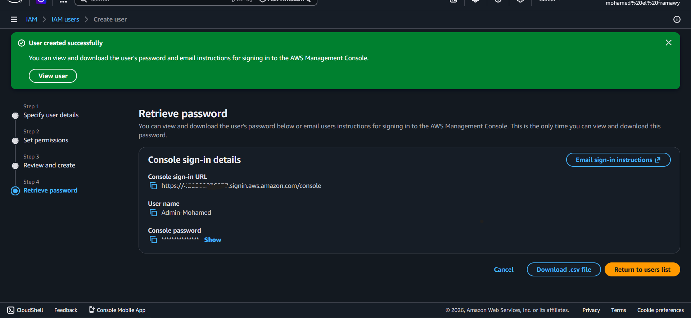
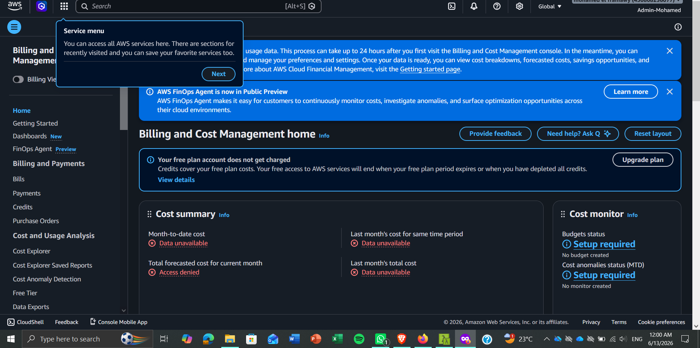
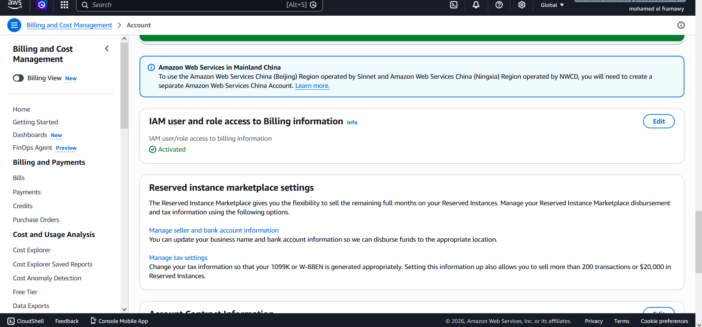
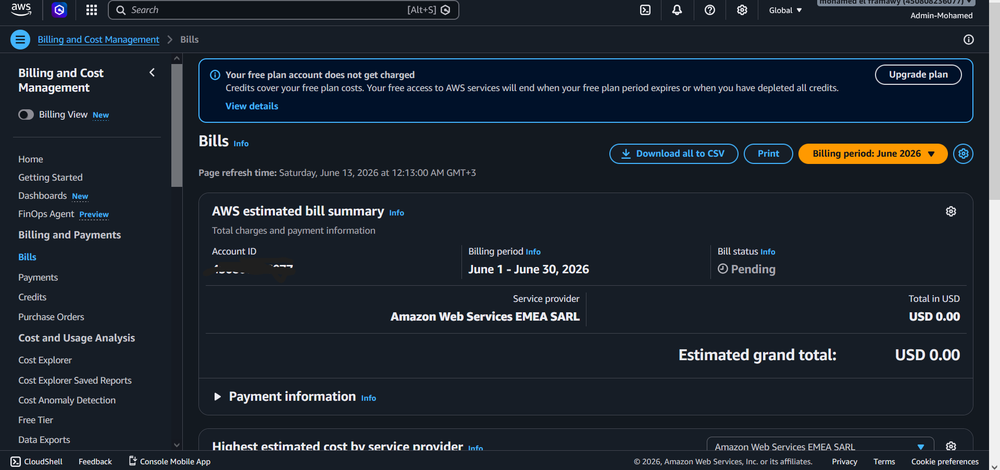
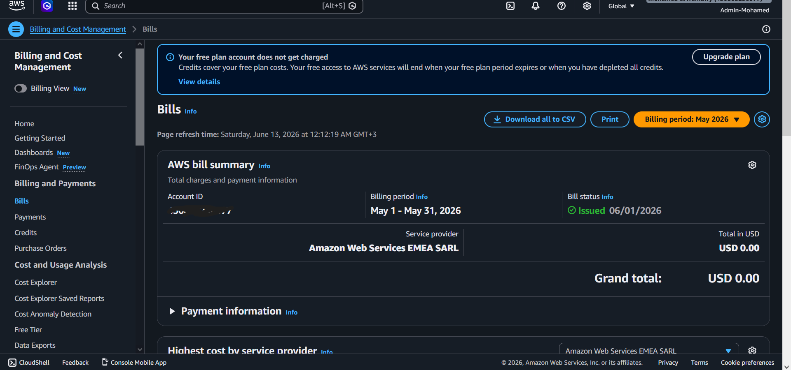

# 🛡️ AWS IAM & Billing Administration

> Hands-on AWS lab demonstrating how to delegate Billing Dashboard access to an IAM Admin user by overriding the default Root-only restriction — step by step.

---

## 🗂️ Table of Contents

- [📌 Task 1 — Create Full Admin IAM User & Group](#-task-1--create-full-admin-iam-user--group)
- [📌 Task 2 — Verification & Access Denied Challenge](#-task-2--verification--access-denied-challenge)
- [📌 Task 3 — Activate IAM Billing Access](#-task-3--activate-iam-billing-access)
- [📌 Task 4 — View Current & Previous Month Bills](#-task-4--view-current--previous-month-bills)
- [📊 Summary](#-summary)

---

## 📌 Task 1 — Create Full Admin IAM User & Group

> 👤 A dedicated IAM user was created and assigned full administrative privileges through a managed group.

**Steps performed:**

1. Navigated to **IAM** service from the top search bar
2. Selected **Users** → clicked **Create user**
3. Set username: **`Admin-Mohamed`**
4. Enabled **`Provide user access to the AWS Management Console`**
5. In the permissions step → selected **Add user to group** → clicked **Create group**
6. Named the group **`Full-Admins`** → attached policy: **`AdministratorAccess`**
7. Selected the new group → clicked **Create user**
8. Downloaded the **`.csv`** credentials file containing:
   - ✅ Custom Console Sign-in URL
   - ✅ Auto-generated temporary password

> 

---

## 📌 Task 2 — Verification & Access Denied Challenge

> ⚠️ This step documents the initial restriction and the resolution process.

**Steps performed:**

1. Opened an **Incognito Window** and accessed AWS via the CSV sign-in URL
2. Logged in as **`Admin-Mohamed`** and updated the temporary password
3. Attempted to access **AWS Billing and Cost Management**

| Attempt | Result |
|---------|--------|
| ❌ Before Root activation | `Access Denied` — You need permissions error |
| ✅ After Root activation | Billing Dashboard loaded successfully |

4. **Resolution:** After enabling billing access from Root account → refreshed the page → restriction fully bypassed ✅

> 

---

## 📌 Task 3 — Activate IAM Billing Access

> 🔐 By default, AWS blocks **all** IAM users from Billing data — even Admins. This step unlocks it from the Root account.

**Steps performed:**

1. Logged into the AWS Management Console as the **Root User** (master email credentials)
2. Clicked the account name (top-right corner) → selected **Account**
3. Re-authenticated for security verification
4. Scrolled to **`IAM User and Role Access to Billing Information`** section
5. Clicked **Edit** → checked **`Activate IAM Access`** → clicked **Update**
6. ✅ Status changed to **`Activated`**

> 

---

## 📌 Task 4 — View Current & Previous Month Bills

> 💰 Final verification that the IAM user can view billing data across different periods.

**Current Month — June 2026**

- ✅ Dashboard loaded with no permission issues
- 💵 Cost summary: **USD 0.00**

> 

**Previous Month — May 2026**

- Clicked **Billing period** dropdown (top-right corner)
- Switched to **May 2026**
- ✅ Historical billing data loaded seamlessly

> 

---

## 📊 Summary

| Task | Action | Status |
|------|--------|:------:|
| 1️⃣ Create IAM User | `Admin-Mohamed` added to `Full-Admins` group | ✅ Done |
| 2️⃣ Verify Access | Tested login + documented Access Denied error | ✅ Done |
| 3️⃣ Activate IAM Billing | Enabled from Root Account settings | ✅ Done |
| 4️⃣ View Bills | June 2026 & May 2026 billing periods confirmed | ✅ Done |

---

## 💡 Key Takeaways

> - 🔐 **Root account** holds exclusive control over Billing access by default — IAM cannot override this without explicit activation
> - 👥 **Groups** are best practice for permission management — never attach policies directly to users
> - 🧾 **AdministratorAccess** does NOT include Billing access unless the Root toggle is enabled first
> - 🔒 Always use **Incognito mode** when testing IAM user access to avoid session conflicts

---

 

*🛡️ AWS IAM & Billing Administration Lab · 2026*

Made with ❤️ by [Mohamed el-faramawy]

