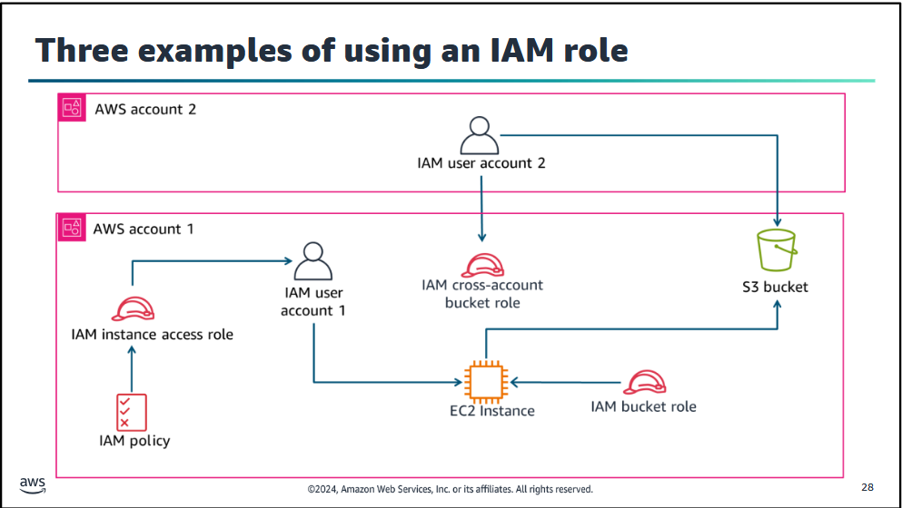
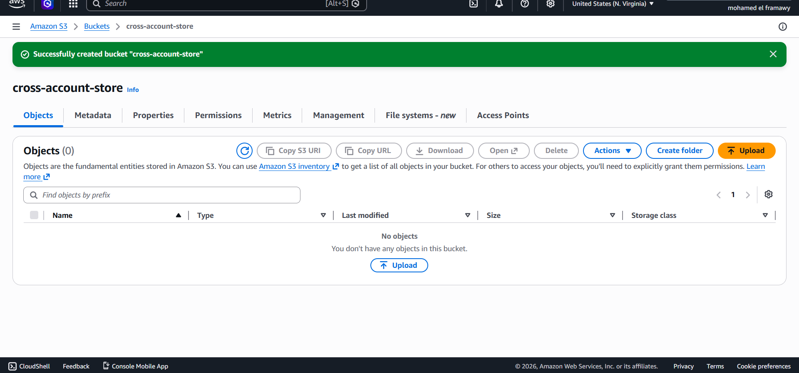
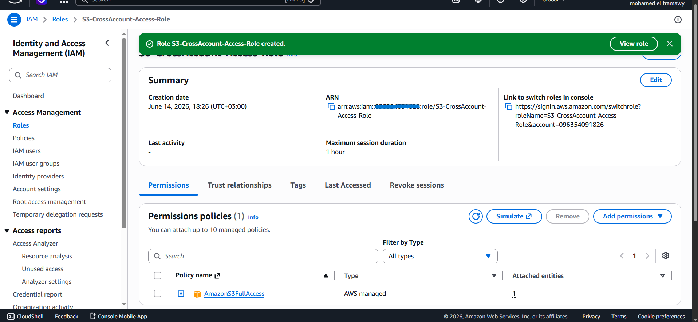
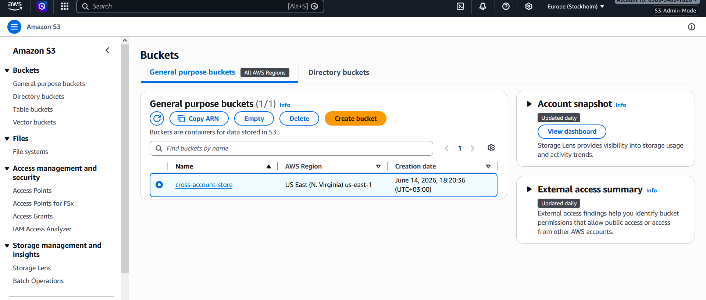
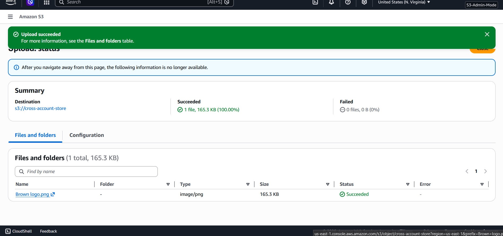
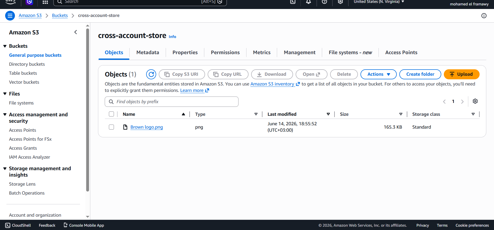

# 🛡️ AWS IAM Cross-Account S3 Access

<div align="center">


> **Hands-on AWS lab** demonstrating how to securely access an S3 Bucket in one AWS Account from an IAM User in another AWS Account using **STS AssumeRole** — step by step.

</div>

---

## 📑 Table of Contents

- [🧠 Overview](#-overview)
- [🏗️ Architecture](#️-architecture)
- [📌 Task 1 — Create S3 Bucket & Cross-Account Role (Account B)](#-task-1--create-s3-bucket--cross-account-role-account-b)
- [📌 Task 2 — Create IAM User & STS Policy (Account A)](#-task-2--create-iam-user--sts-policy-account-a)
- [📌 Task 3 — Verification & Switch Role Challenge](#-task-3--verification--switch-role-challenge)
- [📌 Task 4 — Upload File to Remote Bucket](#-task-4--upload-file-to-remote-bucket)
- [📊 Summary](#-summary)
- [💡 Key Takeaways](#-key-takeaways)

---

## 🧠 Overview

In enterprise cloud environments, resources often span **multiple AWS accounts** for security, billing, and organizational isolation. This lab demonstrates how to:

- ✅ Create a **cross-account IAM Role** with a trust relationship
- ✅ Use **AWS STS AssumeRole** to temporarily gain permissions in another account
- ✅ Access and write to an **S3 bucket** across account boundaries
- ✅ Apply the **Principle of Least Privilege** throughout

---

## 🏗️ Architecture

```

```

---

## 📌 Task 1 — Create S3 Bucket & Cross-Account Role (Account B)

> 📦 Set up the destination storage and the secure bridge in the production account (**Account B — ID: `X`**)

### 🪣 Create S3 Bucket

1. Navigated to **S3** service → clicked **Create bucket**
2. Named the bucket: **`cross-account-store`**
3. Left all default secure settings unchanged


### 🎭 Create Cross-Account IAM Role

4. Navigated to **IAM** → **Roles** → **Create role**
5. Under **Trusted Entity Type** → selected **AWS Account** → checked **Another AWS account**
6. Entered Account A's ID: **`Z`**
7. Attached managed policy: **`AmazonS3FullAccess`**
8. Named the role: **`S3-CrossAccount-Access-Role`**
9. Copied the generated Role ARN:

```
arn:aws:iam::X:role/S3-CrossAccount-Access-Role
```

> 

---

## 📌 Task 2 — Create IAM User & STS Policy (Account A)

> 👤 Provisioned the client identity and the STS permission bridge in the management account (**Account A — ID: `Z`**)

### 👤 Create IAM User

1. Logged into **Account A** → opened **IAM** → clicked **Create user**
2. Set username: **`CrossAccount-User`**
3. Enabled **AWS Management Console access**

### 📋 Create Custom STS Policy

4. In permissions step → selected **Attach policies directly** → clicked **Create policy**
5. Opened the **JSON** tab and injected the explicit **STS AssumeRole** directive:

```json
{
    "Version": "2012-10-17",
    "Statement": [
        {
            "Effect": "Allow",
            "Action": "sts:AssumeRole",
            "Resource": "arn:aws:iam::X:role/S3-CrossAccount-Access-Role"
        }
    ]
}
```

6. Named the policy: **`Assume-S3-CrossRole-Policy`** → clicked **Create policy**
7. Refreshed the list → selected the new policy → clicked **Create user**
8. Downloaded the **`.csv` credentials file**

> 

---

## 📌 Task 3 — Verification & Switch Role Challenge

> ⚠️ Bypassing native account isolation to safely cross security boundaries

### 🔄 Switch Role Steps

1. Opened a fresh **Incognito Window** → accessed AWS via the CSV sign-in URL
2. Logged in as **`CrossAccount-User`** → updated the temporary password
3. Clicked the **profile dropdown** (top-right) → clicked **Switch Role**
4. Filled in the cross-account target fields:

| Field | Input Value | Purpose |
|-------|------------|---------|
| **Account** | `X` | Target Account B ID |
| **Role** | `S3-CrossAccount-Access-Role` | Identity to assume |
| **Display Name** | `S3-Admin-Mode` | Custom console label |

5. Clicked **Switch Role** → Top bar successfully changed to **`S3-Admin-Mode`** ✅

> 
---

## 📌 Task 4 — Upload File to Remote Bucket

> 🏆 Final proof that the IAM user from Account A can read and write inside Account B's bucket

1. While inside the switched role session → opened **Amazon S3**
2. Located and opened the target bucket: **`cross-account-store`**
3. Clicked **Upload** → added local file: **`Brown logo.png`**
4. ✅ Upload completed with **100% Success** and zero permission errors

> 
  

---

## 📊 Summary

| # | Task | Action | Status |
|---|------|--------|--------|
| 1️⃣ | **Target Storage** | Created `cross-account-store` bucket + Trusted Role in Account B | ✅ Done |
| 2️⃣ | **Client Setup** | Created `CrossAccount-User` + STS Policy in Account A | ✅ Done |
| 3️⃣ | **Assume Role** | Executed console Switch Role into Account B boundary | ✅ Done |
| 4️⃣ | **Object Ingest** | Uploaded `Brown logo.png` with full write validation | ✅ Done |

---

## 💡 Key Takeaways

> 🔄 **STS AssumeRole** allows safe temporary cross-boundary execution without sharing Root keys or hardcoded IAM access tokens

> 🛡️ **Principle of Least Privilege** — Even though the assumed role has Full S3 Access, accessing Billing or other unauthorized services in Account B will result in standard **Access Denied** blocks

> 🏷️ **Display Names** help cloud operators instantly visual-audit which account boundary context they are currently executing in

> 🔒 **Production Best Practice** — Always restrict the Trust Relationship Policy down to specific user ARNs to prevent unintended role assumption

---

<div align="center">

🛡️ **AWS IAM Cross-Account S3 Access Lab** · 2026

Made with ❤️ by [Mohamed el-faramawy](https://github.com/Muhammet-DEs)

</div>
