<div align="center">

# 🚀 AWS Hands-On Lab: EC2 Deployment, Automated Backups & Cross-Region Disaster Recovery


**Launching a web server, automating its backups, and proving true disaster recovery by reviving it in a completely different AWS region.**

</div>

---

## 📖 Overview

This lab simulates a real-world **disaster recovery scenario**. Instead of just spinning up an EC2 instance and calling it done, the goal here was to build a full backup-and-recovery pipeline:

1. Launch a web server on EC2.
2. Automate its backups using **AMI** and **EBS Snapshots** — no manual clicking required.
3. Copy those backups to a **second AWS region**.
4. Prove the system actually works by **launching a brand-new EC2 instance from that copied AMI in Ireland** — and watching the same web page appear, untouched.

> 💡 If the original server in N. Virginia disappeared completely, this same AMI could rebuild it from scratch in Ireland within minutes.

---

## 🧰 Tools & Services Used

| Service | Role in this Lab |
|---|---|
| **Amazon EC2** | Hosts the web server (Amazon Linux instance) |
| **Apache (httpd)** | Serves the deployed web page |
| **MobaXterm** | SSH client used to connect and configure the server |
| **Amazon EBS** | Storage volume attached to the instance |
| **AMI (Amazon Machine Image)** | Full snapshot of the server used for recovery |
| **Data Lifecycle Manager (DLM)** | Automates AMI & EBS snapshot creation on a schedule |
| **Tags** | Used to target which resources DLM should back up |
| **Cross-Region Copy** | Replicates AMI & Snapshot from Virginia → Ireland |
| **IAM Role** | Grants DLM the permissions it needs to operate |

---

### Task 1 — Launch EC2 & Configure Security Group 🖥️

The first step was provisioning the EC2 instance that would act as the primary web server.

**Configuration:**

| Setting | Value |
|---|---|
| Region | `us-east-1` (N. Virginia) |
| Name | `Web-Server-Primary` |
| OS | Amazon Linux (default, Free tier eligible) |
| Instance type | `t2.micro` / `t3.micro` |
| Key pair | New RSA key, `.pem` format |
| Security group | New SG created |
| Inbound rules | ✅ SSH (Anywhere) · ✅ HTTP (Internet) |

**Steps:**
1. Opened the AWS Console and confirmed the working **Region** (N. Virginia).
2. Navigated to **EC2** → clicked **Launch Instance**.
3. Set the **Name** to `Web-Server-Primary`.
4. Left the OS as **Amazon Linux** (the AWS default option, Free tier eligible).
5. Chose `t2.micro` / `t3.micro` as the instance type.
6. Created a **new key pair** (RSA, `.pem`) and saved it locally for MobaXterm.
7. Under **Network Settings**, created a new security group and enabled:
   - `Allow SSH traffic from Anywhere`
   - `Allow HTTP traffic from the internet`
8. Clicked **Launch Instance** ✅

> 📌 Once running, the instance's **Public IPv4 address** was copied from the Instances page — this is the address used to connect via MobaXterm in the next step.
---
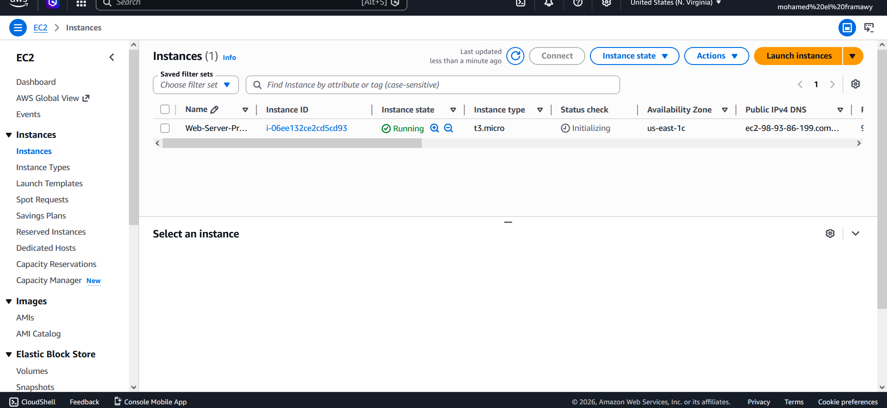
---
---

### Task 2 — Connect via MobaXterm & Install the Web Server 🌐

With the instance running, the next step was connecting to it remotely and deploying a working web page.

**MobaXterm SSH Session Setup:**

| Field | Value |
|---|---|
| Session type | SSH |
| Remote host | EC2 **Public IPv4 address** |
| Specify username | `ec2-user` (Amazon Linux AMI) *or* `ubuntu` (if using an Ubuntu AMI) |
| Advanced SSH settings | ✅ Use private key → select the `.pem` file |

**Steps:**
1. Opened **MobaXterm** and clicked **Session** → **SSH**.
2. Entered the instance's **Public IPv4** as the Remote host.
3. Set the username based on the AMI flavor (`ec2-user` for Amazon Linux, `ubuntu` for Ubuntu — **not interchangeable**).
4. Under **Advanced SSH settings**, enabled **Use private key** and selected the saved `.pem` key.
5. Clicked **OK** to connect — landed on the server's terminal.

**Web server installation & deployment (Amazon Linux example):**

```bash
# 1. Update the system & install Apache (httpd)
sudo dnf update -y
sudo dnf install httpd -y

# 2. Start the service & enable it on boot
sudo systemctl start httpd
sudo systemctl enable httpd

# 3. Deploy a simple custom web page
echo "<h1>Welcome! Web Server Deployed successfully via MobaXterm on AWS</h1>" | sudo tee /var/www/html/index.html
```

> ⚠️ For **Ubuntu**, the equivalent commands use `apt` and the `apache2` package instead of `dnf`/`httpd`.
---
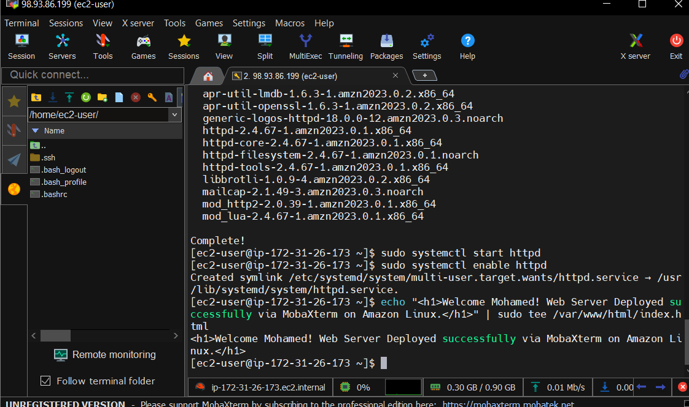
---
**Verification:**
Visited `http://<Public-IP>` in the browser and confirmed the custom message rendered correctly — the web server was live. 🎉
---
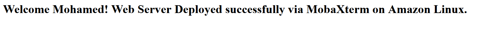
---
> 🛰️ This is the exact checkpoint to take the **first manual snapshot**, before moving on to automation.

---

### Task 3 — Automate Backups with AMI & EBS Snapshots ♻️

Rather than manually creating backups, this task automates the entire process using **AWS Data Lifecycle Manager (DLM)**.

#### 3.1 — Tag the Instance 🏷️

DLM identifies *which* resources to back up using tags — so the instance needed one first.

| Key | Value |
|---|---|
| `Backup` | `True` |

**Steps:**
1. Opened the EC2 Instances page.
2. Selected the instance → **Tags** tab → **Manage tags**.
3. Clicked **Add new tag** → entered `Backup` / `True`.
4. Clicked **Save**.
---
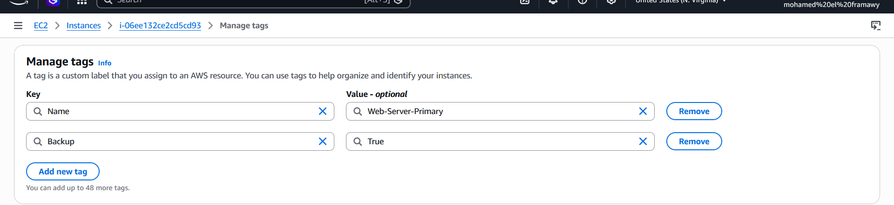
---
#### 3.2 — Configure the Lifecycle Policy ⏱️

**Steps:**
1. From the EC2 sidebar, opened **Elastic Block Store** → **Lifecycle Manager**.
2. Clicked **Create lifecycle policy**.
3. Selected **Policy type**: `EBS-backed AMI policy` (simplest option — backs up both the AMI **and** its underlying EBS snapshot together).
4. Under **Target resources**, set the tag filter to `Backup = True`.
5. Added a **Description**: `My-Automated-Backup`.
6. Set the **IAM Role** to the default role (already has the right permissions).
7. Clicked **Next**.
---
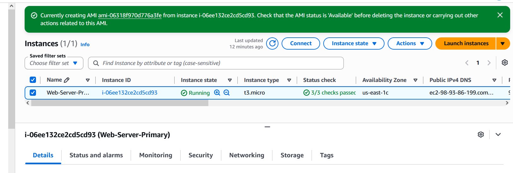
---
#### 3.3 — Set the Schedule 📅

| Setting | Value |
|---|---|
| Schedule name | `Daily-Backup` |
| Frequency | Every 12 hours (or daily, depending on need) |
| Retention type | Count |
| Retention count | `5` (keeps the latest 5 snapshots automatically) |

8. Clicked **Create policy**, then reviewed it on the policy summary page.
---
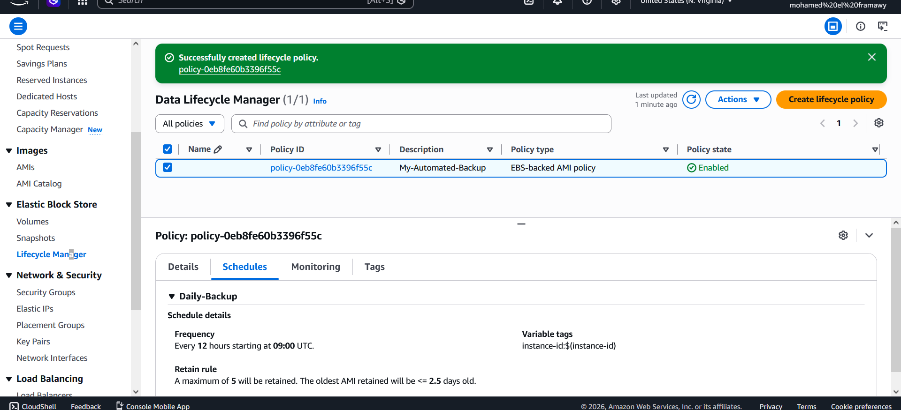
---
> 💡 **Important:** DLM runs on its own internal schedule (e.g., around midnight) — it does **not** trigger instantly. To validate the pipeline without waiting for the schedule, an AMI was created manually once via **Instances** → **Image and templates** → **Create image**, named `Manual-AMI-For-Task`, simulating what DLM would generate automatically.


---

### Task 4 — Copy the AMI & Snapshot to a New Region 🌍

With a working AMI and EBS snapshot in hand (whether from DLM or the manual fallback), the next step was replicating them into a **second AWS Region** — the foundation of real disaster recovery.

| From | To |
|---|---|
| `us-east-1` (N. Virginia) | `eu-west-1` (Ireland) *(or `us-east-2` Ohio)* |

**Steps:**
1. From the **AMIs** page (under Images), located the AMI created earlier.
2. Confirmed its status was **Available**.
3. Selected it → **Actions** → **Copy AMI**.
4. In the **Copy AMI** window:
   - Chose the **Destination Region** (e.g., `eu-west-1` — Ireland).
5. Left the remaining settings as default and clicked **Copy AMI**.
---
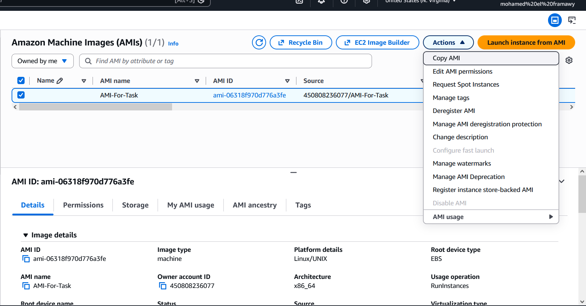
---
> 📌 **Key insight:** Copying the AMI **automatically copies its linked EBS Snapshot** along with it — there's no need to copy the snapshot separately.

**Verification:**
Switched the AWS Console region (top-right) to **Ireland**, opened the **AMIs** page, and waited for the copied AMI's status to flip from *pending* to **Available** (took a couple of minutes).
---
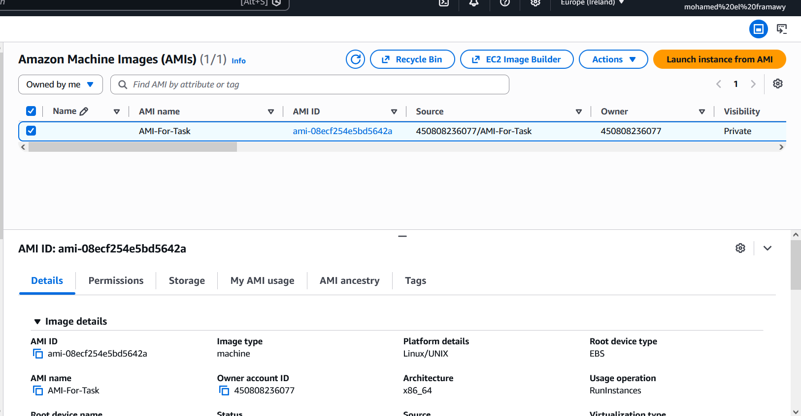
---
---

### Task 5 — Launch a New EC2 Instance from the Copied AMI 🎯

The final and most satisfying step: proving the backup actually works by rebuilding the server from scratch — in a different region.

| Setting | Value |
|---|---|
| Region | `eu-west-1` (Ireland) |
| Source | Copied AMI (`AMI-For-Task`) |
| Name | `Web-Server-Backup-Ireland` |
| Instance type | `t2.micro` (Free tier) |
| Key pair | New key pair created specifically for Ireland |
| Security group | New SG → ✅ SSH · ✅ HTTP |

**Steps:**
1. While still in **Ireland**, opened the copied AMI and clicked **Launch instance from AMI**.
2. Filled in the instance details:
   - Name: `Web-Server-Backup-Ireland`
   - Instance type: `t2.micro` (Free tier)
3. Created a **new key pair** for this region (since the original key only exists locally, a fresh one was generated and saved).
4. Under **Network Settings**, created a new security group with **SSH** and **HTTP** access enabled.
5. Clicked **Launch Instance** 🚀
---
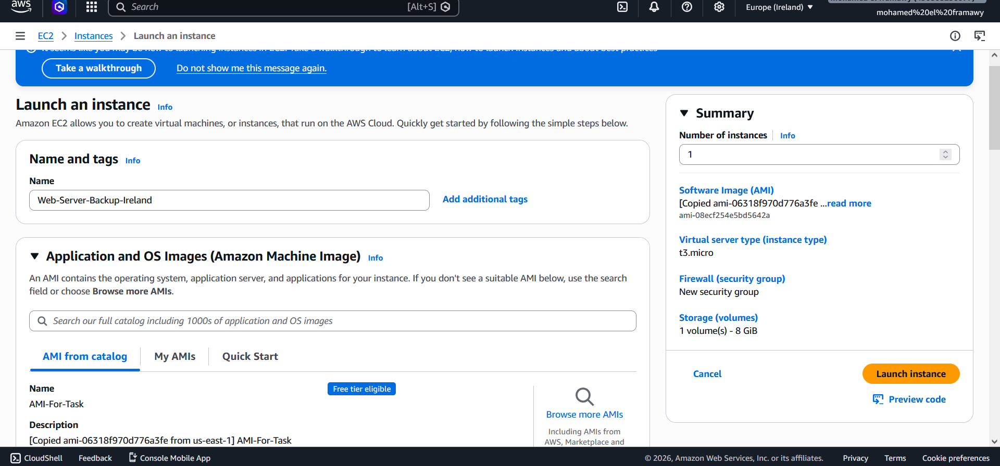
---
#### ✅ Final Success Check

Waited for the instance to reach **Running**, grabbed its **Public IPv4 address**, and opened it in the browser:
---
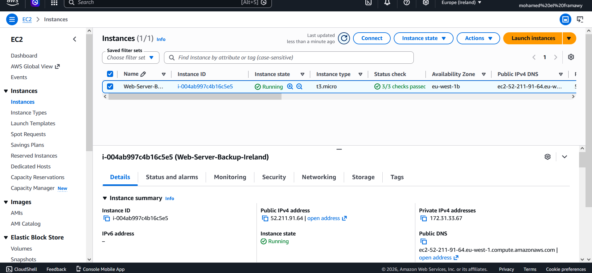
---
```
http://<New-Ireland-Public-IP>
```
---
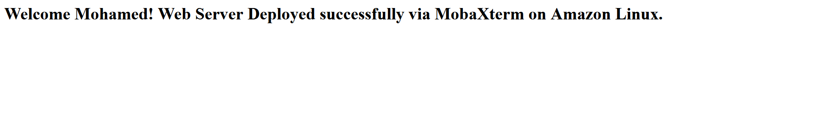
---
The exact same custom welcome message appeared — proving that the **entire stack** (Apache, the deployed page, OS config) had been faithfully reconstructed in a new region, from an automated snapshot pipeline, with zero manual reconfiguration.

---

## 🏆 Key Takeaways

- ✅ DLM eliminates the need for manual, error-prone backup routines.
- ✅ Tag-based targeting makes the backup policy scale cleanly to any number of instances.
- ✅ Copying an AMI brings its EBS snapshot along automatically — one action, full backup.
- ✅ A cross-region AMI copy is a legitimate, tested disaster recovery strategy — not just theory.
- ✅ Username mismatches (`ubuntu` vs `ec2-user`) are a common but easy-to-miss connection blocker.

---

<div align="center">

**📌 Part of an ongoing AWS hands-on learning series — building real infrastructure, one lab at a time.**

</div>
