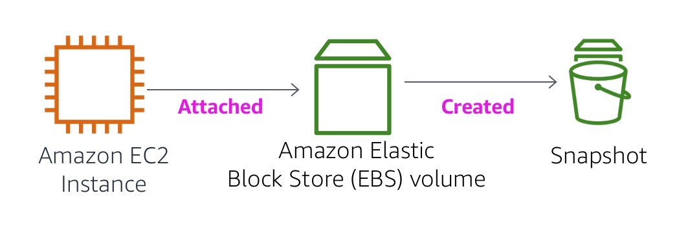
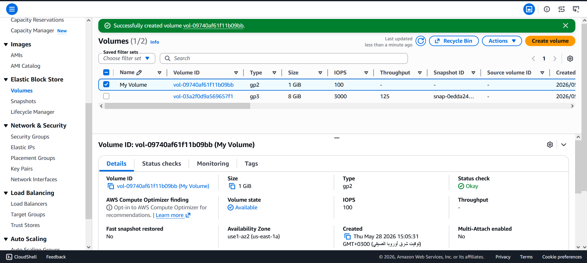
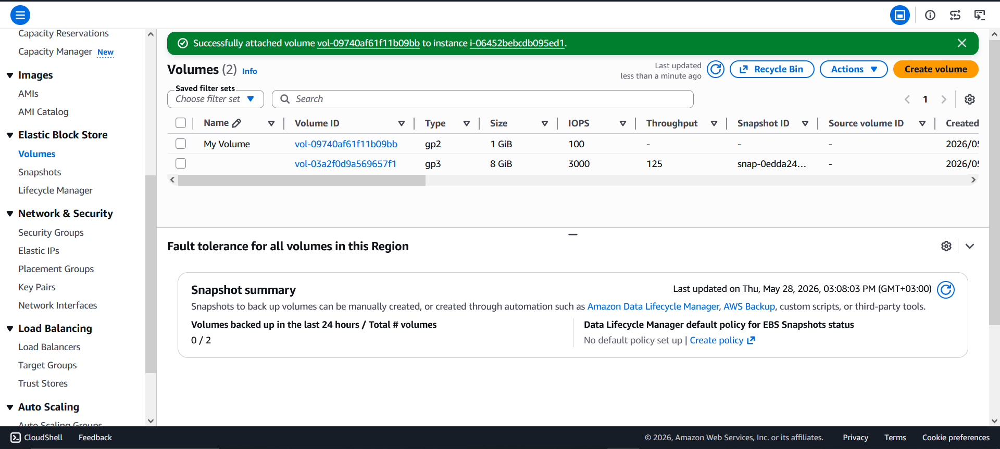
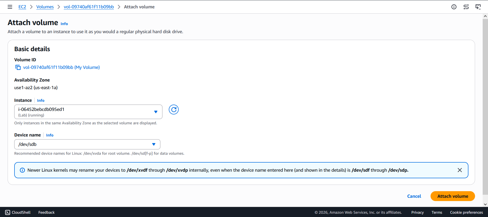
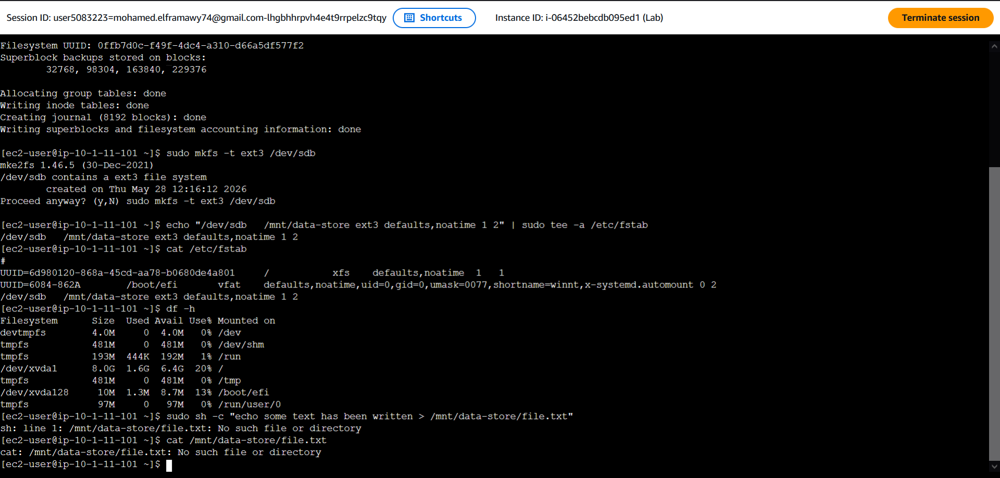
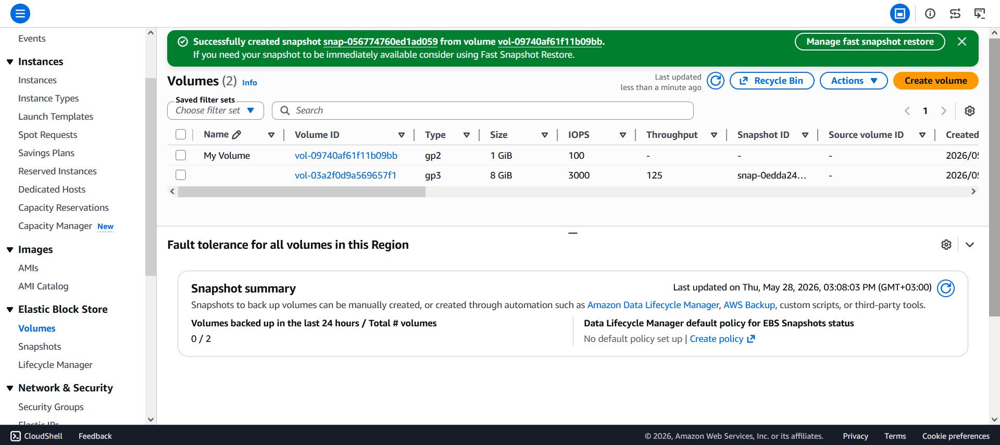
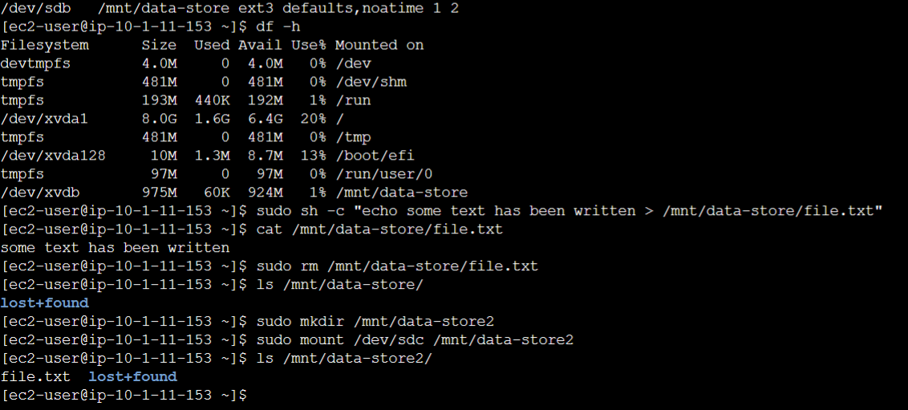

# 💾 AWS EBS Lab — Working with Amazon Elastic Block Store


> A hands-on lab covering how to create, attach, configure, snapshot, and restore Amazon EBS volumes on AWS.

---

## 📋 Table of Contents

- [Overview](#-overview)
- [Objectives](#-objectives)
- [Architecture](#-architecture)
- [What is Amazon EBS?](#-what-is-amazon-ebs)
- [EBS Key Features](#-ebs-key-features)
- [Lab Tasks](#-lab-tasks)
- [Commands Reference](#-commands-reference)
- [Technologies Used](#-technologies-used)
- [Prerequisites](#-prerequisites)

---

## 🌐 Overview

**Amazon Elastic Block Store (Amazon EBS)** provides persistent, high-performance block storage for Amazon EC2 instances. This lab walks through the full EBS lifecycle — creating a volume, attaching it to an instance, formatting it, writing data, snapshotting it, and restoring it to a new volume.

---

## 🎯 Objectives

By completing this lab, you will be able to:

- ✅ Create an **Amazon EBS volume**
- ✅ **Attach and mount** the volume to an EC2 instance
- ✅ Create a **file system** on the volume
- ✅ Write data and **create a snapshot** backup
- ✅ **Restore** a snapshot to a new EBS volume
- ✅ Attach and mount the **restored volume** and verify data integrity

---

## 🏗️ Architecture



---

## 📦 What is Amazon EBS?

Amazon EBS offers **persistent storage** for EC2 instances. Unlike instance store (temporary), EBS volumes:

- 🔁 **Persist independently** from the EC2 instance lifecycle
- 📸 Support **point-in-time snapshots** stored in Amazon S3
- 🔄 Are **automatically replicated** within an Availability Zone
- 📤 Can be **detached and re-attached** to other instances

---

## ⚡ EBS Key Features

| Feature | Details |
|---|---|
| 💾 **Persistent Storage** | Data survives instance stop/start |
| 🔧 **General Purpose** | Works with any OS as a raw block device |
| 🚀 **High Performance** | Equal to or better than local drives |
| 🛡️ **High Reliability** | Built-in redundancy within an AZ |
| 📉 **Low Failure Rate** | Annual Failure Rate (AFR) between 0.1% – 1% |
| 📏 **Variable Size** | Volumes range from **1 GB to 16 TB** |
| ✅ **Easy to Use** | Create, attach, backup, restore, delete with ease |

---

## 🧪 Lab Tasks

### Task 1 — 🆕 Create a New EBS Volume

Opened **EC2 → Volumes** in the AWS Console, noted the EC2 instance's Availability Zone, then created a new volume:

| Setting | Value |
|---|---|
| Volume Type | General Purpose SSD (`gp2`) |
| Size | **1 GiB** |
| Availability Zone | Same as EC2 instance |
| Tag (Name) | `My Volume` |


---

### Task 2 — 🔗 Attach the Volume to the Instance

- Selected **My Volume** → Actions → **Attach Volume**
- Chose the **Lab** EC2 instance
- Assigned device name: **`/dev/sdb`**
- Volume state changed to ✅ **In-use**


---

### Task 3 — 🖥️ Connect to the EC2 Instance

Connected via **AWS Session Manager** (no SSH key needed) and switched to ec2-user:

```bash
sudo su -l ec2-user
```

---

### Task 4 — 🗂️ Create and Configure the File System

- Checked existing storage with `df -h`
- Formatted the new volume as **ext3**
- Created a mount point and mounted the volume
- Configured **auto-mount on boot** via `/etc/fstab`
- Created a test file on the volume

After mounting, the new volume appeared as:
```
/dev/xvdb   976M   1.3M   924M   1%   /mnt/data-store
```

---

### Task 5 — 📸 Create an EBS Snapshot

- Selected **My Volume** → Actions → **Create Snapshot**
- Tagged the snapshot:

| Key | Value |
|---|---|
| Name | `My Snapshot` |

- Snapshot status: `Pending` → ✅ `Completed`
- Deleted the test file to simulate accidental data loss

---

### Task 6 — ♻️ Restore the EBS Snapshot

**Created a new volume from the snapshot:**

| Setting | Value |
|---|---|
| Source | My Snapshot |
| Availability Zone | Same as EC2 instance |
| Tag (Name) | `Restored Volume` |

**Attached and mounted the restored volume, then verified the file was recovered:**

```bash
ls /mnt/data-store2/
# ✅ file.txt is back!
```

---

## 💻 Commands Reference

```bash
# Check current disk usage
df -h

# Format volume as ext3
sudo mkfs -t ext3 /dev/sdb

# Create mount directory
sudo mkdir /mnt/data-store

# Mount the volume
sudo mount /dev/sdb /mnt/data-store

# Auto-mount on boot (persist across restarts)
echo "/dev/sdb   /mnt/data-store ext3 defaults,noatime 1 2" | sudo tee -a /etc/fstab

# Write a test file
sudo sh -c "echo some text has been written > /mnt/data-store/file.txt"

# Verify the file content
cat /mnt/data-store/file.txt

# Delete the file (simulate data loss)
sudo rm /mnt/data-store/file.txt

# Mount the restored volume
sudo mkdir /mnt/data-store2
sudo mount /dev/sdc /mnt/data-store2

# Verify restored data
ls /mnt/data-store2/
```

---

## 🛠️ Technologies Used

| Service | Purpose |
|---|---|
| **Amazon EBS** | Persistent block storage volumes |
| **Amazon EC2** | Virtual server to attach volumes to |
| **Amazon S3** | Backend storage for EBS snapshots |
| **AWS Session Manager** | Browser-based terminal access (no SSH needed) |
| **ext3 File System** | Linux file system applied to the volume |

---

## ✅ Prerequisites

- An active **AWS Account** with EC2 access
- Basic familiarity with **Linux command-line** tools
- Understanding of basic **Amazon EC2** usage
- Lab environment with a pre-launched **Lab EC2 instance**

---

<div align="center">

**© 2026 Amazon Web Services, Inc. — Lab for educational purposes only.**

⭐ *If you found this helpful, consider starring the repository!*

</div>
