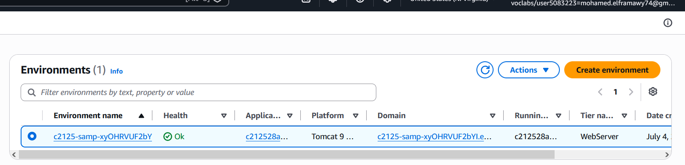
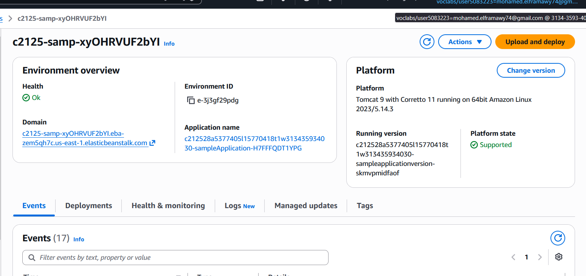
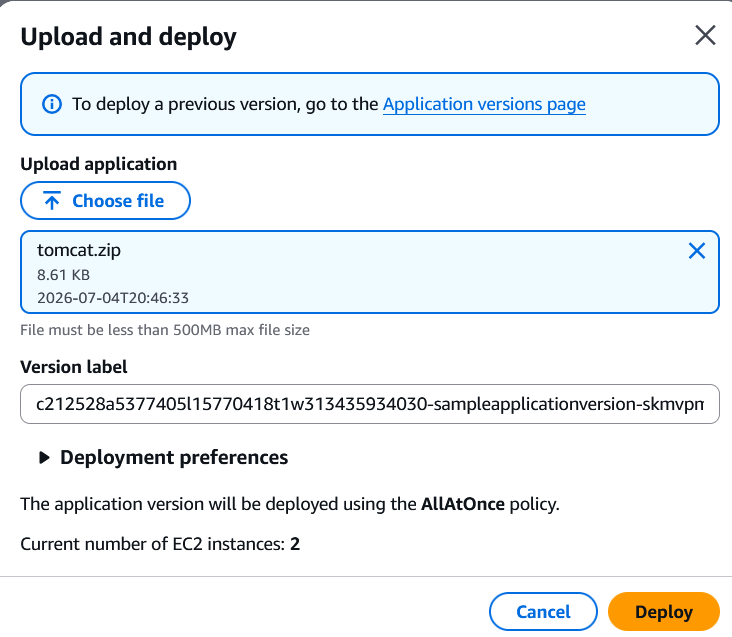
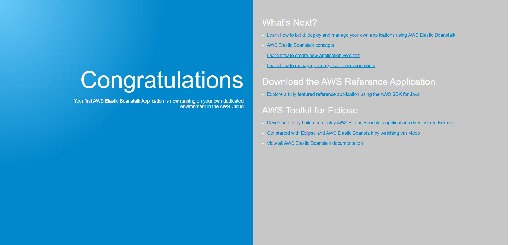
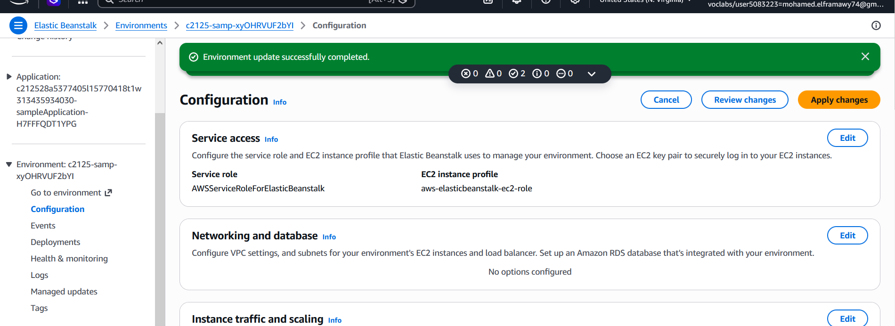
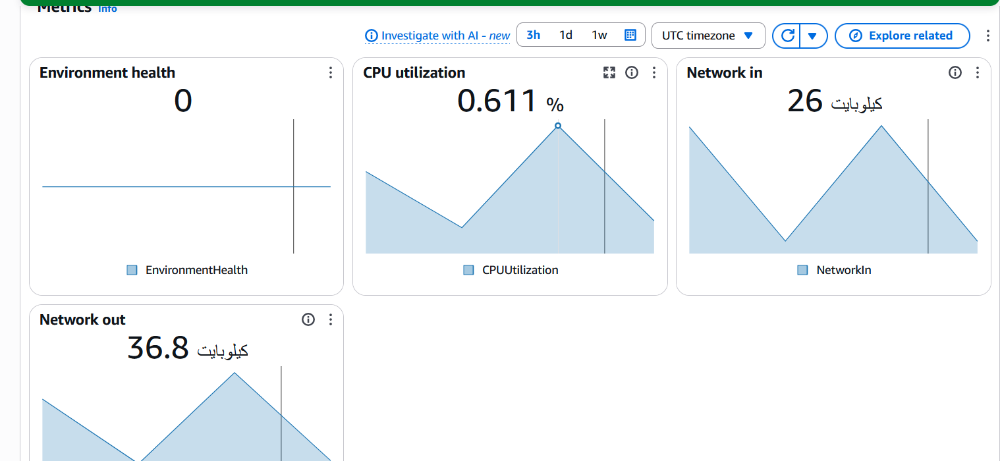
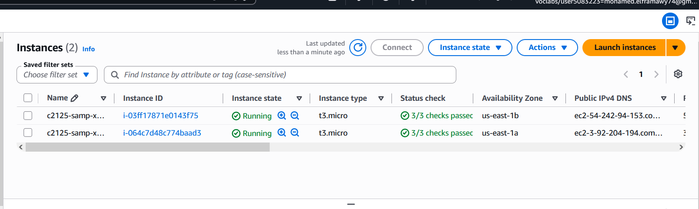

# 🌱 AWS Elastic Beanstalk — Web App Deployment Activity


> Deploying a **Java Tomcat web application** on **AWS Elastic Beanstalk** — a fully managed platform that automatically provisions EC2 instances, a Load Balancer, Auto Scaling, and security groups with zero manual infrastructure setup.

---

## 📖 Overview

AWS Elastic Beanstalk is a Platform as a Service (PaaS) that lets developers deploy and manage applications without worrying about the underlying infrastructure. In this activity, a pre-created Elastic Beanstalk environment is accessed, a sample Java Tomcat application is uploaded and deployed, and the automatically provisioned AWS resources (EC2, Load Balancer, Auto Scaling) are explored.

---

## 🎯 Objectives

- 🌐 Access and explore a **pre-created Elastic Beanstalk environment**
- 🚀 Deploy a **sample Java Tomcat web application** via the console
- ⚙️ Review **environment configuration** (instances, scaling, networking)
- 📊 Explore **monitoring charts** for the running application
- 🔎 Discover the **underlying AWS resources** automatically created by Elastic Beanstalk

---

## 🌐 Task 1: Accessing the Elastic Beanstalk Environment

1. In the AWS Management Console search box, searched for and chose **Elastic Beanstalk**
2. The **Environments** page opened, showing a table with an existing Elastic Beanstalk application
3. Waited until the **Health** column showed **Ok** status (green)

| Column | Value |
|---|---|
| Application name | `elastic-beanstalk-app` |
| Health status | ✅ Ok |
| Code deployed | ❌ None yet |

4. Chose the environment name under the **Environment name** column to open its **Dashboard**
5. Confirmed the dashboard displayed **Health: Ok**
6. Tested access by clicking the **Domain** link (ending in `.elasticbeanstalk.com`)
7. A new browser tab opened showing:

```
HTTP Status 404 - Not Found
```

> ✅ This is **expected behavior** — the environment is healthy and running, but no application code has been deployed to it yet.

8. Returned to the Elastic Beanstalk console to proceed with deployment


---

## 🚀 Task 2: Deploying a Sample Application to Elastic Beanstalk

1. Downloaded the sample Java Tomcat application from:
   ```
   https://docs.aws.amazon.com/elasticbeanstalk/latest/dg/samples/tomcat.zip
   ```
[text](tomcat.zip)
2. Returned to the **Elastic Beanstalk Dashboard**

3. Chose **Upload and Deploy**
4. Chose **Choose File** and selected the downloaded `tomcat.zip` file
5. Chose **Deploy**

6. Waited 1–2 minutes for Elastic Beanstalk to update the environment and deploy the application
7. After deployment completed, chose the **Domain URL** link again (or refreshed the previous browser tab)
8. The deployed web application loaded successfully in the browser

> ✅ The sample Tomcat application is now live and publicly accessible via the Elastic Beanstalk domain URL.


### 2.1 — Reviewing Environment Configuration

1. In the Elastic Beanstalk console, chose **Configuration** from the left panel
2. Reviewed the following panels:

| Panel | Key Details |
|---|---|
| Instance traffic and scaling | EC2 security groups, min/max instances, instance type |
| Networking, database, and tags | No database configured for this environment |

3. In the **Networking, database, and tags** row, chose **Edit**
4. Observed that adding a database (RDS) only requires setting a few fields and choosing **Apply**
5. Chose **Cancel** (no database needed for this activity)


### 2.2 — Exploring Monitoring

1. In the left panel under **Environment**, chose **Monitoring**
2. Browsed through the available charts, including:
   - Request count
   - CPU utilization
   - Network traffic in/out
   - Latency metrics


---

## 🔎 Task 3: Exploring the Underlying AWS Resources

### 3.1 — EC2 Instances

1. In the AWS Management Console search box, searched for and chose **EC2**
2. Chose **Instances**
3. Observed **two running EC2 instances** (both containing `samp` in their names) — automatically created and managed by Elastic Beanstalk

| Instance | Name contains | Status |
|---|---|---|
| Instance 1 | `samp` | ✅ Running |
| Instance 2 | `samp` | ✅ Running |



### 3.2 — Security Group

1. In the EC2 console left panel, chose **Security Groups**
2. Located the security group created by Elastic Beanstalk
3. Confirmed the following inbound rule:

| Type | Protocol | Port | Source |
|---|---|---|---|
| HTTP | TCP | 80 | 0.0.0.0/0 (anywhere) |

📸 *Screenshot placeholder — Security group with port 80 open*
<!--  -->

### 3.3 — Load Balancer

1. In the EC2 console left panel, chose **Load Balancers**
2. Located the load balancer created by Elastic Beanstalk
3. Confirmed **both EC2 instances** are registered as targets
4. Noted the load balancer distributes incoming HTTP traffic across both instances

📸 *Screenshot placeholder — Load Balancer with both instances as targets*
<!--  -->

### 3.4 — Auto Scaling Group

1. In the EC2 console left panel, chose **Auto Scaling Groups**
2. Located the Auto Scaling group created by Elastic Beanstalk
3. Confirmed the scaling configuration:

| Setting | Value |
|---|---|
| Minimum instances | `2` |
| Maximum instances | `6` |
| Scaling trigger | Network load |

> 💡 If traffic increases, Elastic Beanstalk automatically scales **up** to a maximum of 6 instances. When traffic drops, it scales **back down** to the minimum of 2 — all without any manual intervention.

📸 *Screenshot placeholder — Auto Scaling Group configuration min 2 max 6*
<!--  -->

---

## 🧠 Key Concepts Demonstrated

| Concept | Detail |
|---|---|
| 🌱 PaaS | Elastic Beanstalk manages infrastructure — developer focuses only on code |
| 🚀 One-click deploy | Upload a `.zip` file → Beanstalk handles the rest |
| ⚖️ Load Balancing | Automatically distributes traffic across multiple EC2 instances |
| 📈 Auto Scaling | Scales from 2 to 6 instances based on network load |
| 🔓 Security Group | Port 80 automatically opened for HTTP traffic |
| 📊 Built-in Monitoring | CloudWatch metrics exposed directly in the Beanstalk console |
| 🗄️ Optional Database | RDS can be attached to the environment in just a few clicks |

---

## 📋 Elastic Beanstalk Environment Summary

| Property | Value |
|---|---|
| Environment name | `elastic-beanstalk-app` |
| Platform | Java — Apache Tomcat |
| Application file | `tomcat.zip` |
| Health status | ✅ Ok |
| EC2 instances running | 2 (min) — 6 (max) |
| Load balancer | ✅ Auto-provisioned |
| Auto Scaling group | ✅ Auto-provisioned |
| Security group | ✅ Auto-provisioned (port 80) |
| Database | ❌ Not configured |

---

## ⚙️ Elastic Beanstalk vs Manual EC2 Setup

| Task | Manual EC2 Setup | Elastic Beanstalk |
|---|---|---|
| Provision EC2 instances | ❌ Manual | ✅ Automatic |
| Configure Load Balancer | ❌ Manual | ✅ Automatic |
| Set up Auto Scaling | ❌ Manual | ✅ Automatic |
| Create Security Groups | ❌ Manual | ✅ Automatic |
| Deploy application code | ❌ Manual (SSH/scripts) | ✅ Upload .zip → Deploy |
| Monitor metrics | ❌ Manual (CloudWatch setup) | ✅ Built-in dashboard |

---

## 🏁 Result

A Java Tomcat web application was successfully deployed to a pre-created AWS Elastic Beanstalk environment using a single `.zip` file upload. Elastic Beanstalk automatically provisioned and managed all underlying infrastructure — EC2 instances, a Load Balancer, an Auto Scaling group, and a Security Group — demonstrating how PaaS dramatically reduces operational overhead for web application deployment.

---

## 👨‍💻 Author
<div align="center">

> Made with ❤️ by [Mohamed el-faramawy](https://github.com/Muhammet-DEs)
---
⭐ *If you found this helpful, feel free to star the repo!*

</div>
