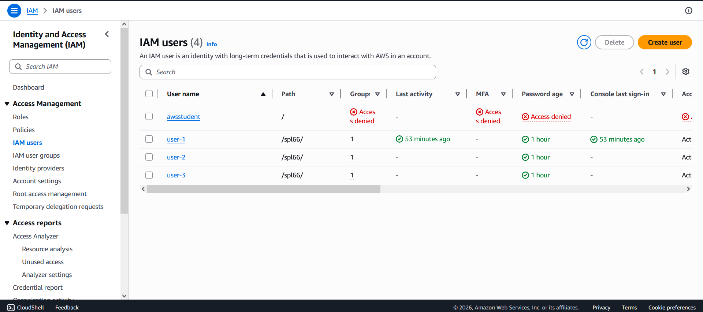
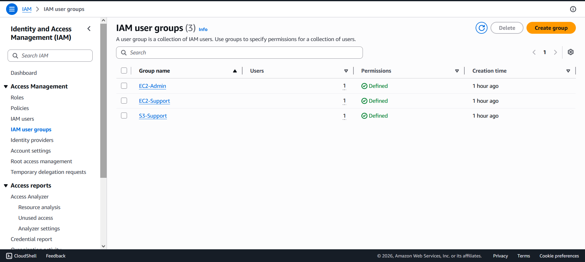
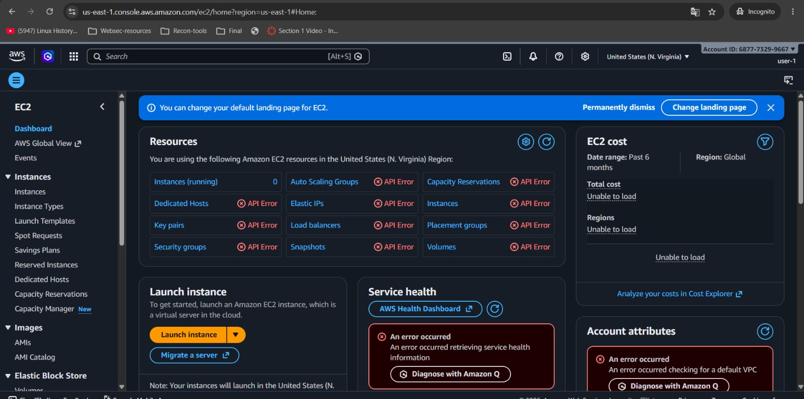

# 🔐 AWS IAM Fundamental Laboratory: Identity & Access Management

An enterprise-grade documentation and repository blueprint based on the **AWS Identity and Access Management (IAM)** fundamental lab. This project outlines the core concepts of cloud governance, the Principle of Least Privilege (PoLP), and step-by-step verification of user authorization boundaries.

---

## 🛠️ System Architecture Diagram

The mapping below illustrates the relationship between IAM identities, administrative boundaries, policy configurations, and access controls implemented within the AWS Account:

---

## 📋 Business Assignment & Matrix

To support a rapidly expanding infrastructure workload, corporate personnel must be granted granular access boundaries categorized precisely by individual job responsibilities:

| User Identity | Target IAM Group | Attached Policy Name / Type | Permitted Service Actions |
| :--- | :--- | :--- | :--- |
| **`user-1`** | `S3-Support` | `AmazonS3ReadOnlyAccess`   *(AWS Managed)* | • `s3:Get*` • `s3:List*` • Inspect bucket object structures |

| **`user-2`** | `EC2-Support` | `AmazonEC2ReadOnlyAccess`   *(AWS Managed)* | • `ec2:Describe*` • Monitor CloudWatch & Auto Scaling metrics |

| **`user-3`** | `EC2-Admin` | `EC2-Admin-Inline-Policy`   *(Inline Custom)* | • `ec2:Describe*` • `ec2:StartInstances` • `ec2:StopInstances` |

---

## 🧠 Key IAM Structural Pillars

### 💡 AWS Managed Policies vs. Inline Policies
* **AWS Managed Policies:** Pre-configured standalone policies authored and updated systematically by AWS. They facilitate immediate deployment across multiple identities (e.g., `AmazonEC2ReadOnlyAccess`).
* **Inline Policies:** Custom configurations embedded strictly within a single explicit IAM identity (User or Group). Ideal for localized, one-off edge cases to avoid systemic privilege expansion.

### 📄 Structural Components of a JSON Policy Document
Every authorization rule block fundamentally parses three core elements:
1. **`Effect`**: Declares an explicit `Allow` or `Deny`.
2. **`Action`**: Specifies target service API methods (e.g., `ec2:StopInstances`, `s3:ListBucket`).
3. **`Resource`**: Pins permissions to specific ARN identifiers or utilizes wildcard asterisks (`*`) for global service scope.

---

## 🚀 Execution & Implementation Protocol

### Phase 1: Identity & Privilege Discovery
1. Authenticate into the master administrative console.
2. Navigate to **IAM** ➡️ **Users** and audit default state profiles for `user-1`, `user-2`, and `user-3` (confirm baseline is set to 0 active policy attachments).
3. Navigate to **User groups** and analyze programmatic access bounds across `EC2-Admin`, `EC2-Support`, and `S3-Support`.

### Phase 2: Group Assignment Matrix Execution
1. Open the **`S3-Support`** interface, navigate to the **Users** sub-tab, and append **`user-1`**.
2. Open the **`EC2-Support`** interface, navigate to the **Users** sub-tab, and append **`user-2`**.
3. Open the **`EC2-Admin`** interface, navigate to the **Users** sub-tab, and append **`user-3`**.
4. Double-check the global dashboard to confirm the exact sync profile (`Users` column counter value equals `1` across all rows).

### Phase 3: Empirical Boundary Testing
Using an isolated **Incognito / Private Window**, navigate to your designated account login string (`https://<ACCOUNT_ID>.signin.aws.amazon.com/console`) and validate operational limits:

* **Authentication Test Case `user-1`**:
  * **Result**: Successfully processes list operations inside the **S3 Console**.
  * **Error Boundary**: Attempting to launch the **EC2 dashboard** flags an explicit `"You are not authorized to perform this operation"` barrier.
  

* **Authentication Test Case `user-2`**:
  * **Result**: Can fully observe live states inside the **EC2 instance list**.
  * **Error Boundary**: Triggering `Instance State -> Stop` prompts an API access denial message. Accessing the **S3 console** flags a structural list bucket block.

* **Authentication Test Case `user-3`**:
  * **Result**: Fully views target infrastructure hosts, selects the instance `LabHost`, changes state smoothly, and executes a verified remote shutdown sequence.

---

## 🛑 Security Observations & Best Practices

* **Principle of Least Privilege (PoLP):** Staff permissions must precisely parallel operational requirements. Over-provisioning increases an organization's lateral exposure vector.
* **Separation of Duties:** Administrators handling high-compute infrastructure elements (EC2) are programmatically isolated from structural corporate assets residing inside persistent buckets (S3).
* **Deterministic Logging:** Every administrative action validated throughout the testing routine compiles audit traces under AWS CloudTrail monitoring logs.

---
*Disclaimer: Created and compiled for educational deployment blueprints and cloud governance architectures. All structural access flags represent intended design behaviors.*
