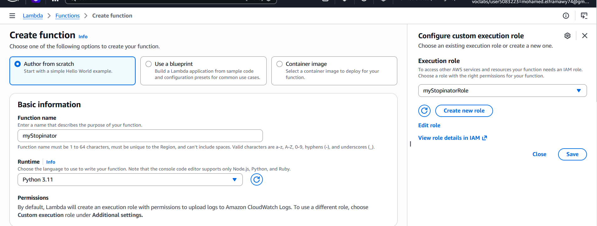
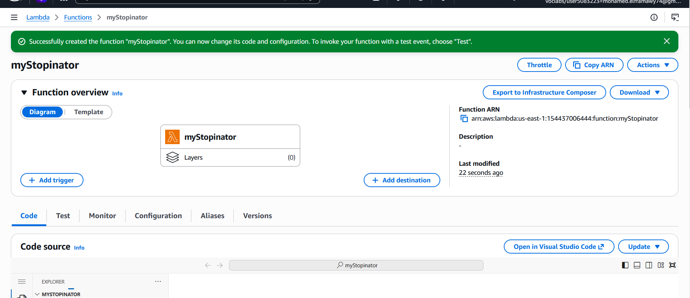
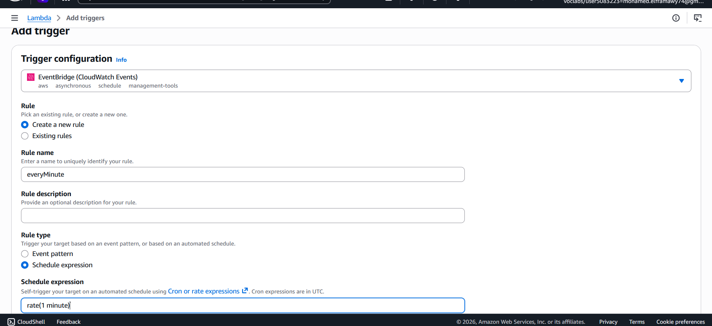
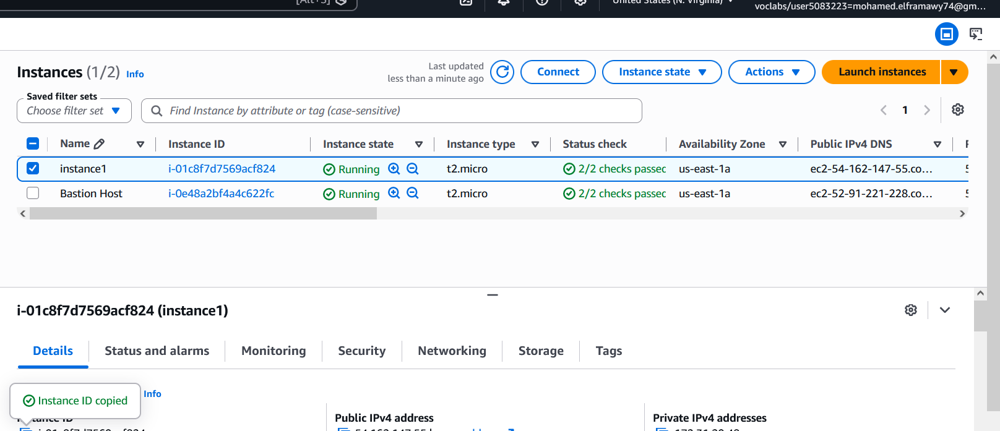
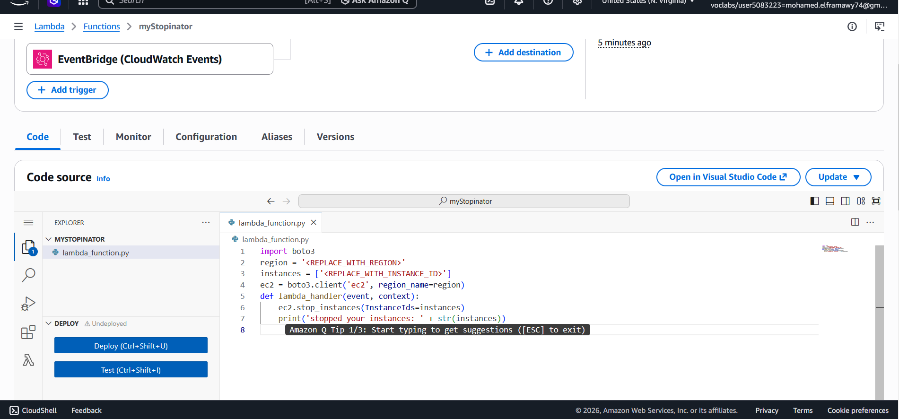
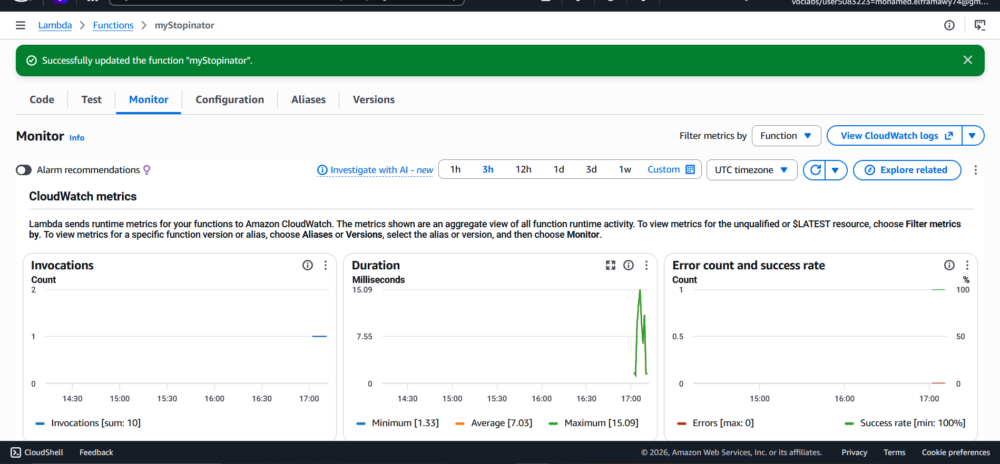
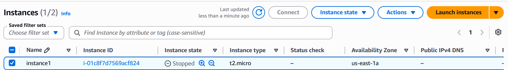

# ⚡ AWS Lambda — EC2 Stopinator Activity


> Building a serverless **EC2 Stopinator** using **AWS Lambda** triggered automatically every minute by **Amazon EventBridge** — no servers required.

---

## 📖 Overview

In this activity, a Python-based AWS Lambda function named **myStopinator** is created to automatically stop a running EC2 instance. An **Amazon EventBridge** scheduled rule fires the function every minute. The function runs under a pre-configured **IAM role** that grants it permission to stop EC2 instances — demonstrating how serverless compute can automate infrastructure management tasks without any always-on server.

---

## 🎯 Objectives

- 🛠️ Create an **AWS Lambda function** from scratch using Python 3.11
- ⏰ Configure an **Amazon EventBridge** scheduled trigger (rate-based)
- 🐍 Write and deploy **Python code** that stops an EC2 instance via Boto3
- ✅ Verify the function executed successfully using **CloudWatch monitoring**
- 🔎 Observe EC2 instance state changes triggered by the Lambda function

---

## 🏗️ Architecture


---

## 🛠️ Task 1: Creating the Lambda Function

1. In the AWS Management Console search box, searched for and chose **Lambda**
2. Chose **Create a function**
3. Configured the function with the following settings:

| Setting | Value |
|---|---|
| Author from scratch | ✅ Selected |
| Function name | `myStopinator` |
| Runtime | `Python 3.11` |
| Execution role | Use an existing role |
| Existing role | `myStopinatorRole` |

4. Chose **Create function**

> 💡 `myStopinatorRole` is a pre-configured IAM role that grants the Lambda function permission to call `ec2:StopInstances` on any instance in the account.


---

## ⏰ Task 2: Configuring the EventBridge Trigger

1. Inside the Lambda function page, chose **Add trigger**
2. From the **Select a trigger** dropdown, selected **EventBridge (CloudWatch Events)**
3. Chose **Create a new rule** and configured it:

| Setting | Value |
|---|---|
| Rule name | `everyMinute` |
| Rule type | `Schedule expression` |
| Schedule expression | `rate(1 minute)` |

4. Chose **Add**

> 💡 `rate(1 minute)` fires the Lambda function every 60 seconds — ideal for quick lab testing. In a real production stopinator, a `cron()` expression would be used to target specific times (e.g. shut down dev servers at 6 PM daily).


---

## 🐍 Task 3: Configuring the Lambda Function Code

1. Below the **Function overview** pane, chose the **Code** tab
2. Chose **lambda_function.py** to open the code editor
3. Deleted the existing placeholder code entirely
4. Pasted the following Python code:

```python
import boto3

region = '<REPLACE_WITH_REGION>'
instances = ['<REPLACE_WITH_INSTANCE_ID>']
ec2 = boto3.client('ec2', region_name=region)

def lambda_handler(event, context):
    ec2.stop_instances(InstanceIds=instances)
    print('stopped your instances: ' + str(instances))
```

5. Replaced `<REPLACE_WITH_REGION>` with the actual AWS Region code:

| Region Name | Region Code |
|---|---|
| US East (N. Virginia) | `us-east-1` |
| US West (Oregon) | `us-west-2` |
| Europe (Ireland) | `eu-west-1` |

> ⚠️ Keep the **single quotation marks** around the region value — e.g. `'us-east-1'`

6. Navigated to the **Amazon EC2 console** in a new tab and:
   - Located the running instance named **instance1**
   - Copied its **Instance ID** (format: `i-0abc1234def56789`)

7. Returned to the Lambda console and replaced `<REPLACE_WITH_INSTANCE_ID>` with the copied Instance ID

> ⚠️ Keep the **single quotation marks** around the instance ID — e.g. `'i-0abc1234def56789'`

The final code looks like this example:

```python
import boto3

region = 'us-east-1'
instances = ['i-0abc1234def56789']
ec2 = boto3.client('ec2', region_name=region)

def lambda_handler(event, context):
    ec2.stop_instances(InstanceIds=instances)
    print('stopped your instances: ' + str(instances))
```

8. Chose **File → Save**
9. In the **Code source** box, chose **Deploy**

> ✅ The Lambda function is now fully configured and will attempt to stop `instance1` every minute.


---

## ✅ Task 4: Verifying the Lambda Function Worked

### 4.1 — Monitoring Invocations in CloudWatch

1. Inside the Lambda function page, chose the **Monitor** tab
2. Observed the **Invocations** chart — confirmed the function was triggered at least once
3. Observed the **Error count and success rate** chart — confirmed 0 errors and 100% success rate

| Metric | Expected Value |
|---|---|
| Invocations | ≥ 1 per minute |
| Error count | 0 |
| Success rate | 100% |



### 4.2 — Verifying EC2 Instance State

1. Switched to the **Amazon EC2 console** browser tab
2. Located **instance1** and observed its state
3. Clicked the **refresh** icon — confirmed the instance state changed to **Stopped**



### 4.3 — Testing What Happens When the Instance is Restarted

1. Manually started **instance1** again from the EC2 console
2. Waited approximately 1 minute
3. Observed that the Lambda function triggered again automatically and **stopped the instance again**

> 🔴 **Result:** The instance cannot stay running — the Lambda function stops it again within 60 seconds. This demonstrates how automated enforcement policies can be built using serverless functions.


---

## 🧠 Key Concepts Demonstrated

| Concept | Detail |
|---|---|
| ⚡ Serverless compute | Lambda runs code without provisioning or managing servers |
| ⏰ Event-driven execution | EventBridge triggers Lambda on a `rate(1 minute)` schedule |
| 🔐 IAM Role | `myStopinatorRole` grants least-privilege EC2 stop permission |
| 🐍 Boto3 SDK | Python AWS SDK used to call `ec2.stop_instances()` |
| 📊 CloudWatch Monitoring | Invocation count, error rate, and logs tracked automatically |
| 💰 Cost efficiency | No server cost — Lambda charges only for execution time |

---

## 📋 Lambda Function Configuration Summary

| Property | Value |
|---|---|
| Function name | `myStopinator` |
| Runtime | Python 3.11 |
| IAM Role | `myStopinatorRole` |
| Trigger | EventBridge — `rate(1 minute)` |
| SDK used | `boto3` |
| Action performed | `ec2.stop_instances()` |
| Target instance | `instance1` |

---

## 🔁 rate() vs cron() — EventBridge Expressions

| Expression type | Example | When it runs |
|---|---|---|
| `rate()` | `rate(1 minute)` | Every 60 seconds — used in this lab |
| `cron()` | `cron(0 18 ? * MON-FRI *)` | Every weekday at 6:00 PM UTC |

> In a real-world scenario, a **cron expression** is preferred for a stopinator — e.g. automatically shutting down dev/test EC2 instances at the end of the business day to save costs.

---

## 🏁 Result

A fully serverless EC2 Stopinator was built using AWS Lambda and Amazon EventBridge. The function runs every minute, automatically stopping a target EC2 instance — demonstrating how event-driven automation can enforce infrastructure policies without any always-on compute resources.

---

## 👨‍💻 Author
<div align="center">

> Made with ❤️ by [Mohamed el-faramawy](https://github.com/Muhammet-DEs)
---
⭐ *If you found this helpful, feel free to star the repo!*

</div>