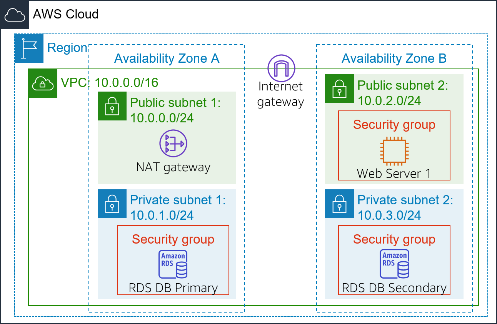
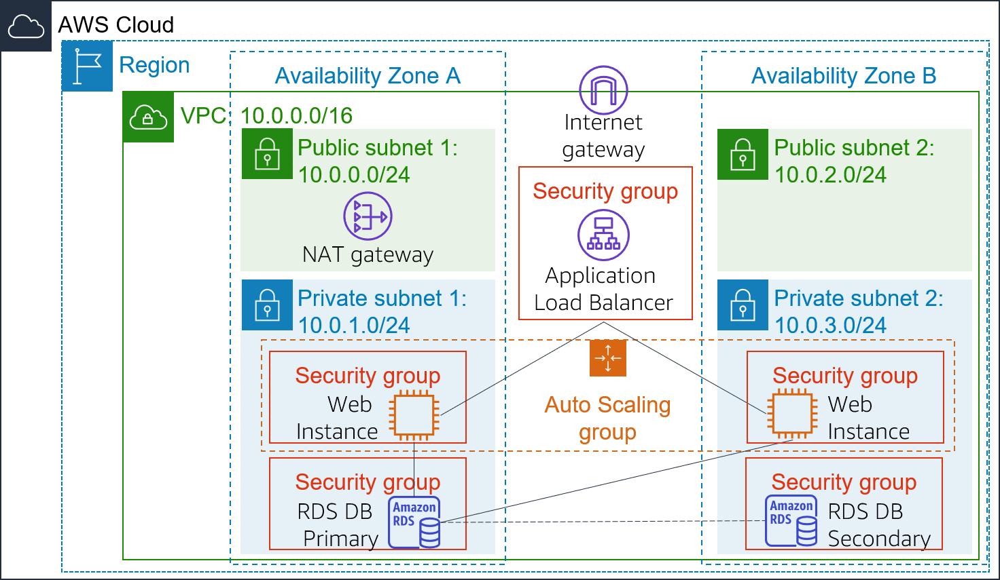
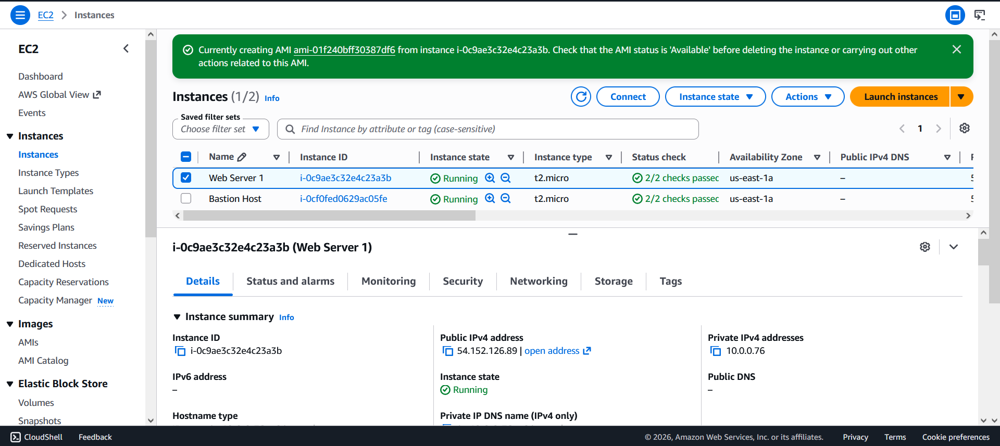
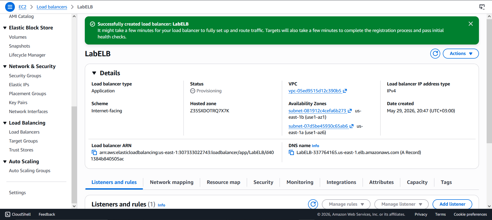
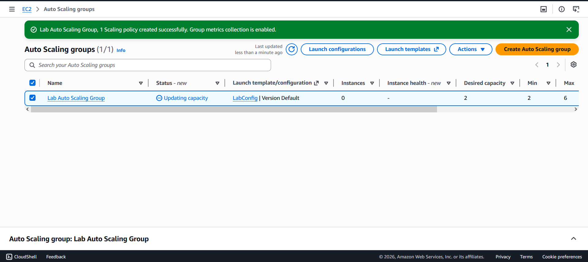
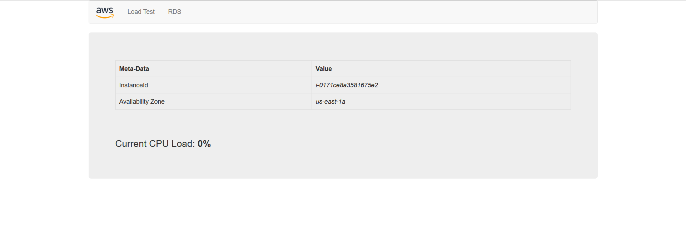
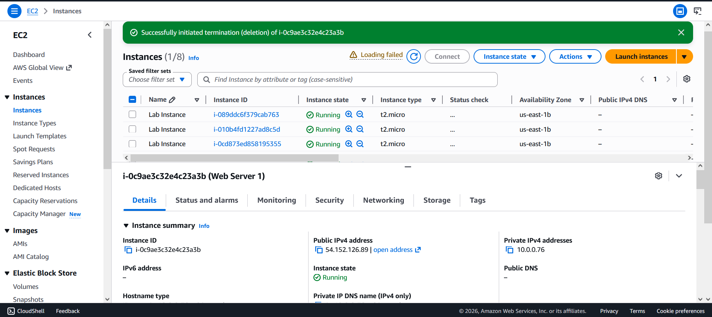

# ⚖️ AWS Lab — Scale and Load Balance Your Architecture


> A hands-on lab demonstrating how to build a highly available, fault-tolerant, and auto-scaling web infrastructure using AWS Elastic Load Balancing (ELB) and EC2 Auto Scaling.

---

## 📋 Table of Contents

- [Overview](#-overview)
- [Objectives](#-objectives)
- [Architecture](#-architecture)
- [Key Services](#-key-services)
- [Lab Tasks](#-lab-tasks)
- [Auto Scaling Configuration](#-auto-scaling-configuration)
- [CloudWatch Alarms](#-cloudwatch-alarms)
- [Technologies Used](#-technologies-used)
- [Prerequisites](#-prerequisites)

---

## 🌐 Overview

This lab demonstrates how to combine **Elastic Load Balancing (ELB)** and **EC2 Auto Scaling** to build a resilient, self-healing architecture that:

- Automatically **distributes traffic** across multiple EC2 instances
- **Scales out** when CPU demand is high and **scales in** when demand drops
- Maintains **fault tolerance** across multiple Availability Zones
- Uses **CloudWatch alarms** to trigger scaling events in real time

---

## 🎯 Objectives

By completing this lab, you will be able to:

- ✅ Create an **Amazon Machine Image (AMI)** from a running instance
- ✅ Create an **Application Load Balancer** with a Target Group
- ✅ Create a **Launch Template** for Auto Scaling
- ✅ Configure an **Auto Scaling Group** with scaling policies
- ✅ Monitor infrastructure using **Amazon CloudWatch alarms**
- ✅ Verify **automatic scaling** under load

---

## 🏗️ Architecture

### Starting Architecture




### Final Architecture




## 🔑 Key Services

| Service | Role |
|---|---|
| 🔀 **Elastic Load Balancing (ELB)** | Distributes traffic across EC2 instances |
| 📈 **EC2 Auto Scaling** | Automatically adjusts instance count based on demand |
| 🖼️ **Amazon AMI** | Snapshot used to launch identical instances |
| 📊 **Amazon CloudWatch** | Monitors metrics and triggers scaling alarms |
| 🎯 **Target Groups** | Defines which instances receive load balancer traffic |
| 📋 **Launch Template** | Blueprint for launching new Auto Scaling instances |

---

## 🧪 Lab Tasks

### Task 1 — 🖼️ Create an AMI for Auto Scaling

Created a custom AMI from the existing **Web Server 1** instance to use as the base image for all Auto Scaled instances:

| Setting | Value |
|---|---|
| Image Name | `WebServerAMI` |
| Image Description | `Lab AMI for Web Server` |
| Source Instance | Web Server 1 |

> 💡 This AMI captures the boot disk contents so every new instance launched by Auto Scaling is pre-configured and identical.

---

### Task 2 — ⚖️ Create a Load Balancer

**Step 1 — Created a Target Group:**

| Setting | Value |
|---|---|
| Target Type | Instances |
| Target Group Name | `LabGroup` |
| VPC | Lab VPC |

**Step 2 — Created an Application Load Balancer:**

| Setting | Value |
|---|---|
| Load Balancer Name | `LabELB` |
| Scheme | Internet-facing |
| VPC | Lab VPC |
| Subnets | Public Subnet 1 + Public Subnet 2 |
| Security Group | Web Security Group |
| Listener | HTTP:80 → forward to `LabGroup` |

---

### Task 3 — 📋 Create a Launch Template & Auto Scaling Group

**Launch Template Configuration:**

| Setting | Value |
|---|---|
| Template Name | `LabConfig` |
| AMI | Web Server AMI |
| Instance Type | `t2.micro` |
| Key Pair | `vockey` |
| Security Group | Web Security Group |
| CloudWatch Monitoring | ✅ Detailed (1-minute intervals) |

**Auto Scaling Group Configuration:**

| Setting | Value |
|---|---|
| Group Name | `Lab Auto Scaling Group` |
| Launch Template | `LabConfig` |
| VPC | Lab VPC |
| Subnets | Private Subnet 1 + Private Subnet 2 |
| Load Balancer | Attached to `LabGroup` |
| Desired Capacity | **2** |
| Minimum Capacity | **2** |
| Maximum Capacity | **6** |
| Scaling Policy | `LabScalingPolicy` |
| Metric | Average CPU Utilization |
| Target Value | **60%** |
| Instance Tag | `Name = Lab Instance` |


---

### Task 4 — ✅ Verify Load Balancing

- Confirmed **2 Lab Instances** launched by Auto Scaling
- Verified both instances passed **health checks** in `LabGroup` (Status: `healthy`)
- Accessed the app via the **Load Balancer DNS name**:
```
http://LabELB-xxxxxxxxxx.us-west-2.elb.amazonaws.com
```
- ✅ Application loaded successfully through the Load Balancer

---

### Task 5 — 🔥 Test Auto Scaling

1. Opened **CloudWatch → All Alarms** — confirmed 2 alarms created automatically
2. Triggered **Load Test** from the web application UI
3. Monitored **AlarmHigh** (CPU > 60%) transition to `In alarm` state
4. Auto Scaling **automatically launched additional instances** to handle the load
5. Verified new **Lab Instances** appeared in EC2 console

---

### Task 6 — 🗑️ Terminate Web Server 1

- Terminated the original **Web Server 1** instance since the AMI was already captured and the Auto Scaling group now manages all instances

---

## 📈 Auto Scaling Configuration

| Scenario | Action |
|---|---|
| CPU > 60% for 3+ minutes | 🔼 Add instances (scale out) |
| CPU < 60% | 🔽 Remove instances (scale in) |
| Always | Keep between **2** and **6** instances |

---

## 🔔 CloudWatch Alarms

| Alarm | Condition | Action |
|---|---|---|
| **AlarmHigh** | Average CPU > 60% | Scale **OUT** — add EC2 instances |
| **AlarmLow** | Average CPU < 60% | Scale **IN** — remove EC2 instances |

---

## 🛠️ Technologies Used

| Service | Purpose |
|---|---|
| **Amazon EC2** | Virtual server compute instances |
| **Amazon AMI** | Instance image for consistent deployments |
| **Elastic Load Balancing** | Traffic distribution across instances & AZs |
| **EC2 Auto Scaling** | Automatic instance scaling based on demand |
| **Amazon CloudWatch** | Metrics monitoring and alarm-based triggers |
| **AWS Launch Templates** | Reusable instance configuration blueprints |
| **Target Groups** | Health-checked instance pools for the load balancer |

---

## ✅ Prerequisites

- An active **AWS Account** with EC2 and CloudWatch access
- Basic familiarity with **Amazon EC2** and the AWS Management Console
- Lab environment with a pre-launched **Web Server 1** instance and **Lab VPC**

---

<div align="center">

**© 2023 Amazon Web Services, Inc. — Lab for educational purposes only.**

⭐ *If you found this helpful, consider starring the repository!*

</div>
