# ☕ Café Static Website — Amazon S3 Challenge Lab


> Hosting a static café website on **Amazon S3**, then hardening it with versioning, lifecycle rules, and cross-Region replication for disaster recovery.

---

## 📖 Scenario

A small café run by **Frank**, **Martha**, **Sofía**, and **Nikhil** has no web presence and no cloud footprint. Word-of-mouth only carries the business so far — it's time to put the café on the map with a static website built on Amazon S3, with proper data protection, cost optimization, and disaster recovery baked in.

---

## 🎯 Objectives

- 🌐 Host a static website using **Amazon S3**
- 🛡️ Protect data with **S3 Versioning**
- 💰 Optimize storage costs with **Lifecycle Policies**
- 🔁 Implement **Disaster Recovery** with Cross-Region Replication (CRR)

---

---

### Task 1: 📦 Extracting the Lab Files

1. Downloaded the lab `.zip` file provided for this lab
2. Extracted the contents to a local folder
3. Confirmed the extracted contents included:
   - `index.html`
   - `images/` folder (containing the café's image assets)

 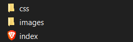 

### Task 2: 🪣 Creating the S3 Bucket to Host the Website

1. Opened the **Amazon S3** console
2. Chose **Create bucket**
3. Set the Region to **US East (N. Virginia) `us-east-1`**
4. Gave the bucket a globally unique name
5. Under **Block Public Access settings**, **cleared (unchecked)** "Block all public access"
6. Under **Object Ownership**, **enabled ACLs** (set to "ACLs enabled")
7. Acknowledged the public access warning and created the bucket

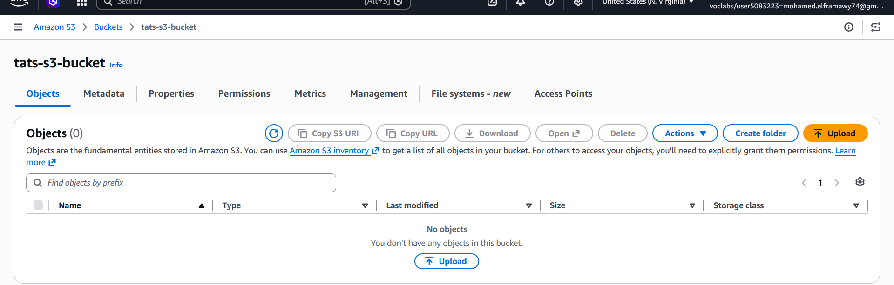 
```
```
8. Opened the new bucket → **Properties** tab
9. Scrolled to **Static website hosting** → chose **Edit**

```
```
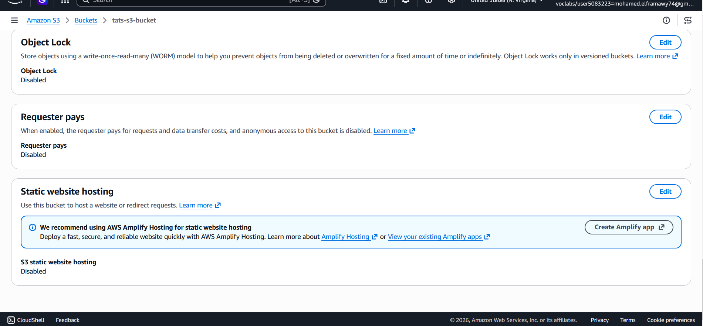 
```
```
10. Selected **Enable**
11. Set **Index document** to `index.html`
12. Saved changes and noted the generated **bucket website endpoint** URL

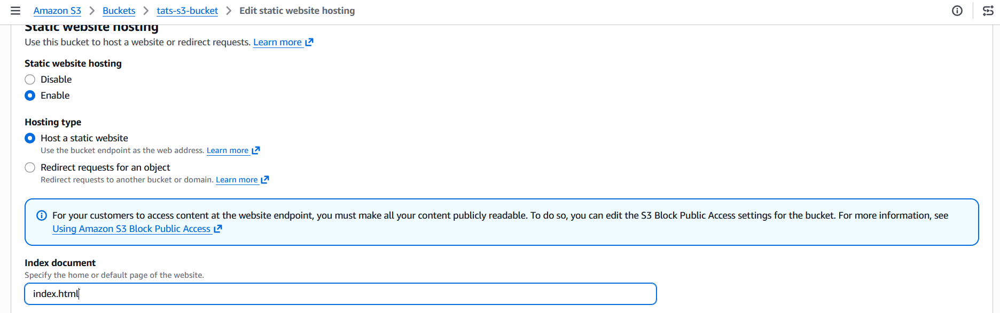
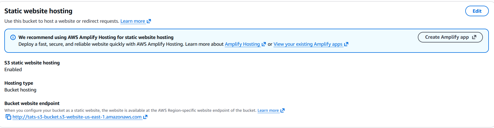
```
```
### Task 3: ⬆️ Uploading Content to the S3 Bucket

1. Opened the bucket → **Objects** tab
2. Chose **Upload**

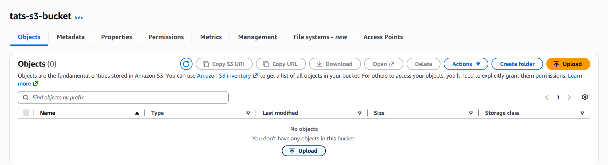
3. Added the `index.html` file
4. Added the CSS file(s) and the `images/` folder (preserving folder structure)
5. Completed the upload
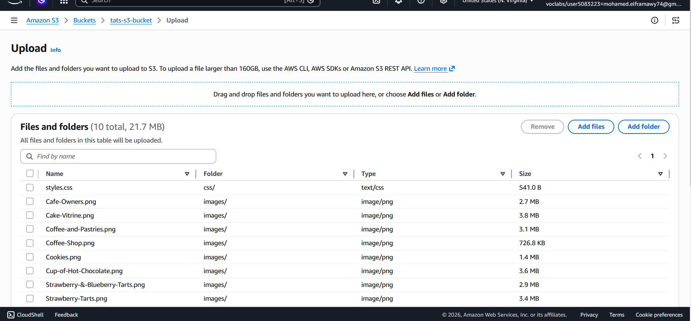
6. Opened a new browser tab and navigated to the static website endpoint URL
7. Observed that the page did **not** render correctly yet (objects were not publicly accessible)
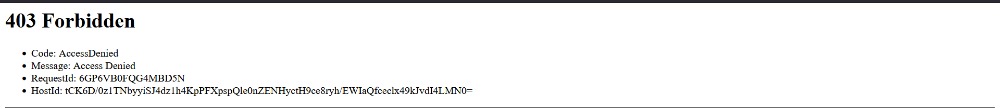

### Task 4: 🔐 Creating a Bucket Policy for Public Read Access

1. Opened the bucket → **Permissions** tab
2. Scrolled to **Bucket policy** → chose **Edit**
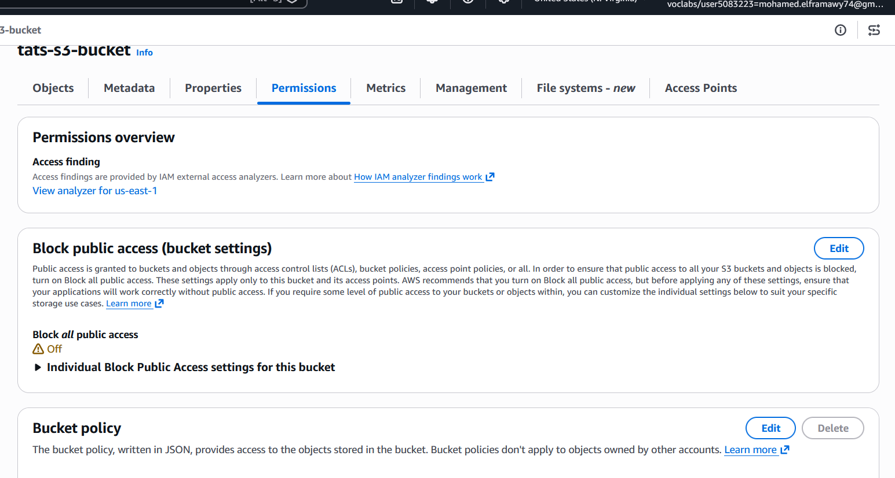
3. Used the AWS-documented JSON example for granting public **read-only** access and adapted it with the bucket's ARN, e.g.:
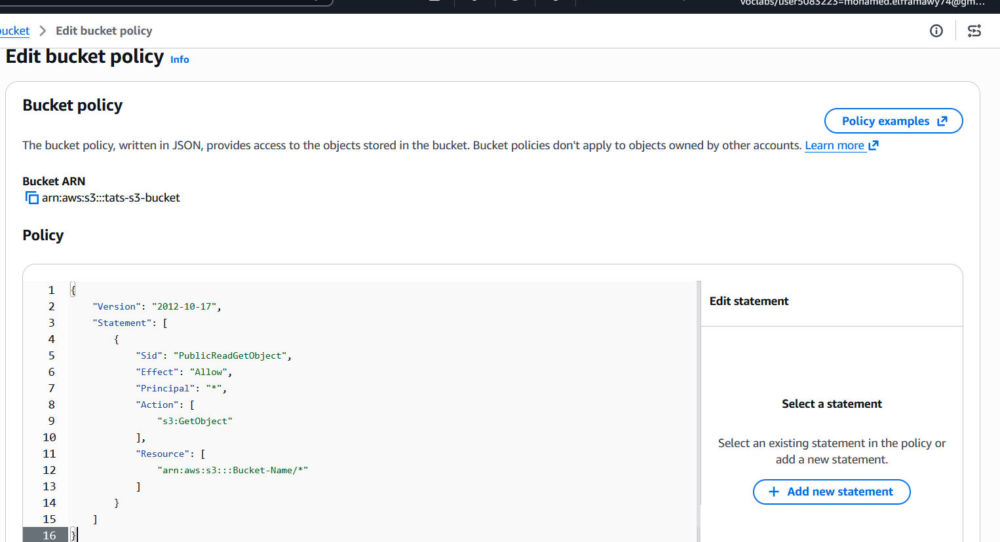

4. Saved the policy
5. Reopened the website endpoint URL in the browser
6. Confirmed the café website now loaded correctly with all images and styling
7. Confirmed any newly uploaded object would automatically inherit public read access (no manual ACL step needed per object)

> ✅ **Outcome:** Café website live and publicly reachable via the S3 website endpoint.
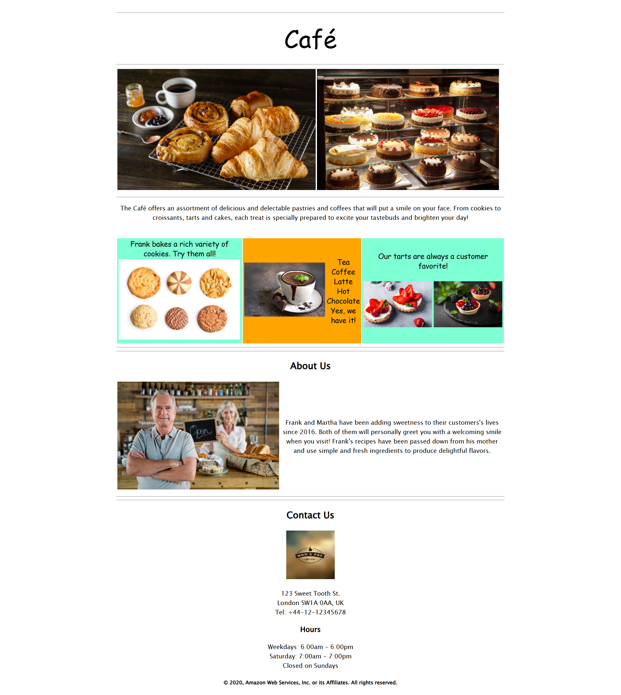

---

### Task 5: 🕒 Enabling Versioning on the S3 Bucket

1. Opened the bucket → **Properties** tab
2. Scrolled to **Bucket Versioning** → chose **Edit**
3. Selected **Enable** → saved changes (noted this action cannot be undone, only suspended)
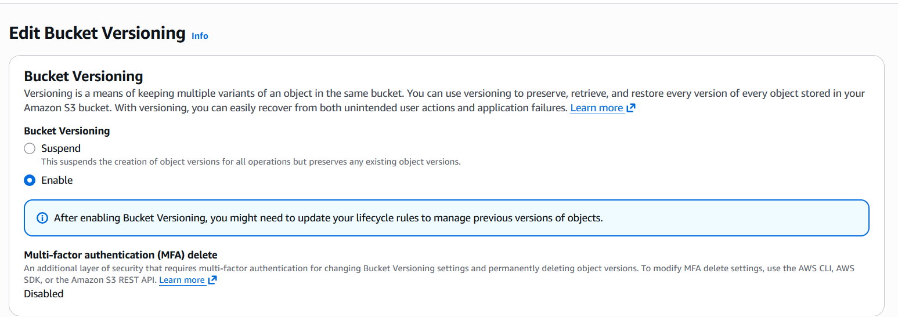
4. Opened `index.html` locally in a text editor
5. Located the **first** instance of `bgcolor="aquamarine"` and changed it to `bgcolor="gainsboro"`
6. Located the instance of `bgcolor="orange"` and changed it to `bgcolor="cornsilk"`
7. Located the **second** instance of `bgcolor="aquamarine"` and changed it to `bgcolor="gainsboro"`
8. Saved the edited file
9. Returned to the S3 console and uploaded the updated `index.html`, overwriting the existing object
10. Reloaded the website browser tab and confirmed the background color changes appeared
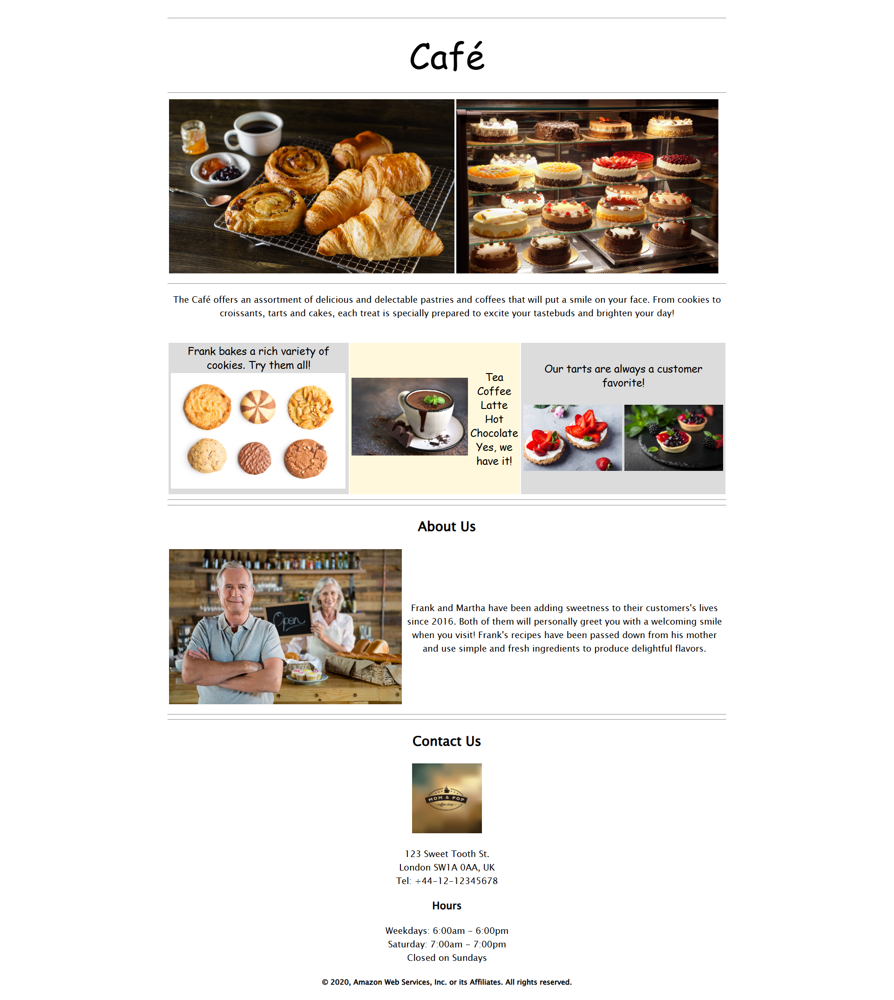
11. In the bucket's **Objects** tab, toggled **Show versions**
12. Confirmed **two versions** of `index.html` were now listed
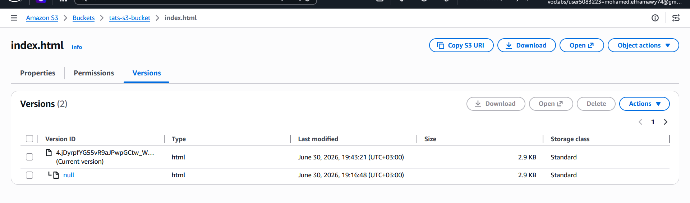


---

### Task 6: ♻️ Setting Lifecycle Policies

1. Opened the bucket → **Management** tab
2. Chose **Create lifecycle rule**
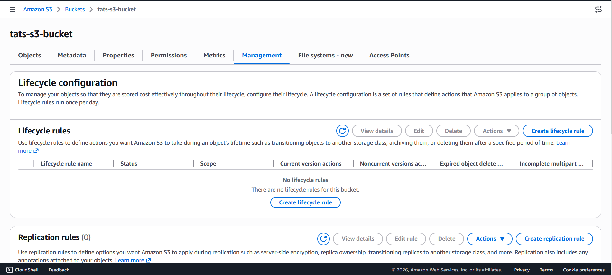
3. **Rule 1 — Transition to Standard-IA:**
   - Named the rule (e.g. `transition-noncurrent-to-IA`)
   - Scope: applied to all objects in the bucket
   - Under **Lifecycle rule actions**, selected **Move noncurrent versions of objects between storage classes**
   - Set transition to **S3 Standard-IA** after **30 days**
   - Created the rule
   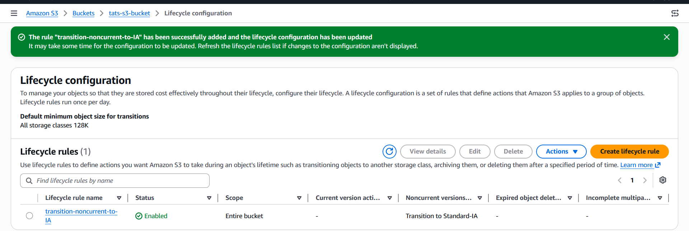
4. **Rule 2 — Expire previous versions:**
   - Chose **Create lifecycle rule** again
   - Named the rule (e.g. `expire-noncurrent-versions`)
   - Scope: applied to all objects in the bucket
   - Under **Lifecycle rule actions**, selected **Permanently delete noncurrent versions of objects**
   - Set expiration to **365 days**
   - Created the rule
   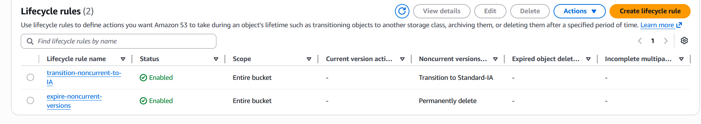
5. Confirmed **two separate rules** appeared under the Management tab (not combined into a single rule)

> ✅ **Outcome:** Noncurrent object versions automatically transition to cheaper storage at 30 days, then permanently expire at 365 days.
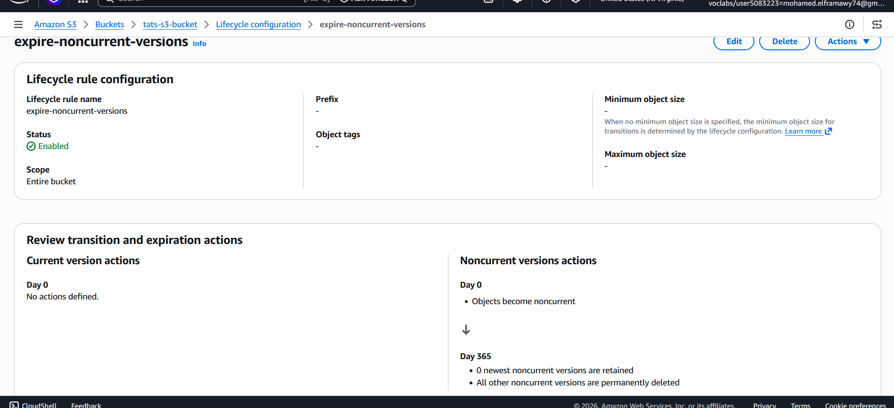

---

### Task 7: 🔁 Enabling Cross-Region Replication (Disaster Recovery)

1. In the S3 console, chose **Create bucket** again
2. Selected a **different AWS Region** than the source bucket's Region
3. Gave the destination bucket a unique name and created it
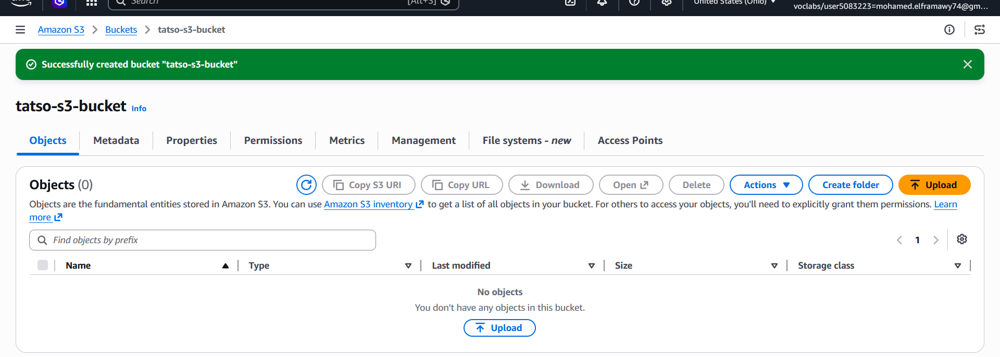
4. Opened the destination bucket → **Properties** → enabled **Bucket Versioning**
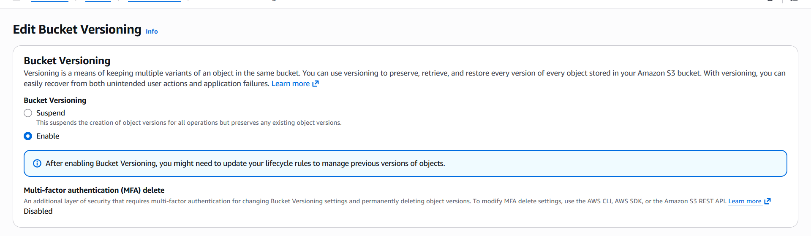
5. Returned to the **source** bucket → **Management** tab
6. Chose **Create replication rule**
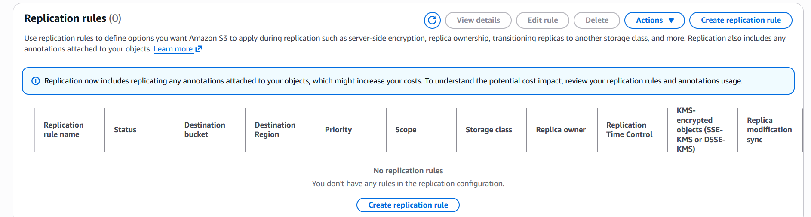
7. Set the rule scope to **Apply to all objects in the bucket**
8. Set the destination to the newly created bucket (in the other Region)
9. Under **IAM role**, selected the existing role **`CafeRole`**
10. Left **Replicate existing objects** set to **No**
11. Saved the replication rule (dismissed the "rule is saved but might not work" warning if it appeared)
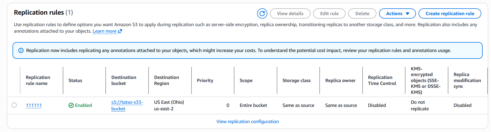
12. Made a small additional edit to `index.html` locally and saved it
13. Uploaded the updated `index.html` to the **source** bucket
14. Verified under **Show versions** that the source bucket now showed **three versions** of `index.html`
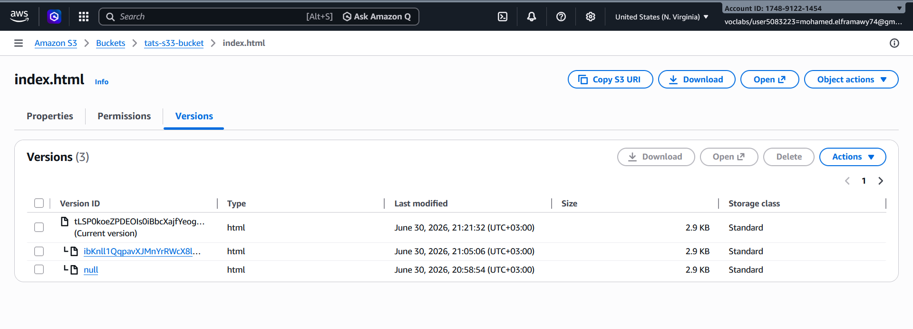
15. Opened the **destination** bucket and confirmed the new version had replicated (reloaded the console if needed)
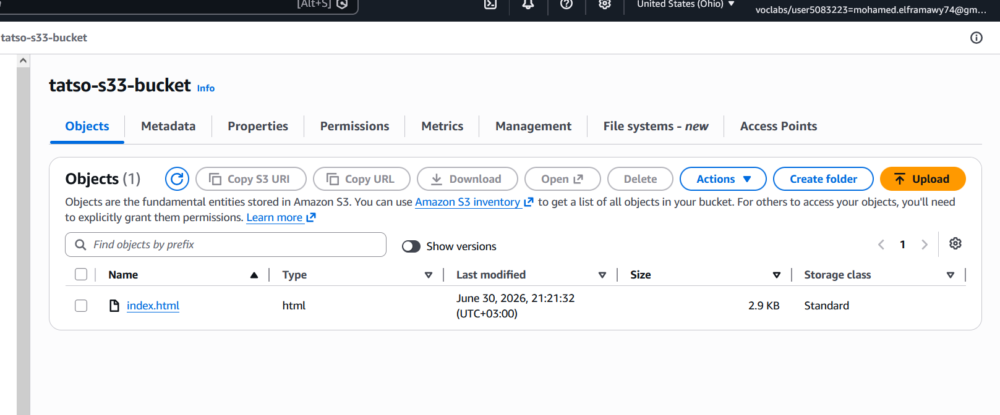
16. Returned to the **source** bucket and deleted the **latest version** of `index.html`
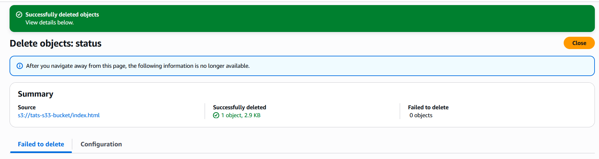
17. Checked the **destination** bucket to see whether the same version/delete marker was removed

**`CafeRole` IAM Policy (provided for this lab):**

```yaml
Version: 2012-10-17
Statement:
  - Effect: Allow
    Action:
      - s3:ListBucket
      - s3:ReplicateObject
      - s3:ReplicateDelete
      - s3:ReplicateTags
      - s3:Get*
    Resource: '*'
```

> ⚠️ In production, scope `Resource` down to the specific source/destination bucket ARNs instead of `'*'`.

> ✅ **Outcome:** Source and destination buckets stay in sync for both new objects **and** deletions — a working DR posture.

---

## 🧠 Key Concepts Demonstrated

| Best Practice | S3 Feature Used |
|---|---|
| 🌐 Static web hosting | S3 Website Endpoint |
| 🔓 Public content delivery | Bucket Policy |
| 🛡️ Data protection | Versioning (+ MFA Delete) |
| 💰 Cost optimization | Lifecycle Rules (Standard-IA → Expire) |
| 🔁 Disaster recovery | Cross-Region Replication |

---

## 📋 Lab Questions Summary

| # | Question | Answer Source |
|---|---|---|
| 1 | Is the website visible after Task 3? | ✅ Yes |
| 2 | How to maximize protection against accidental deletion? | MFA Delete |
| 3 | Do objects appear in the destination bucket? | ✅ Yes |
| 4 | Was the deleted version also removed from the destination? | ✅ Yes (delete marker replicated) |

---

## 🏁 Result

A fully functional, publicly accessible café website hosted on Amazon S3 — protected by versioning, cost-optimized via lifecycle rules, and replicated cross-Region for disaster recovery.

---

## 👨‍💻 Author
<div align="center">

> Made with ❤️ by [Mohamed el-faramawy](https://github.com/Muhammet-DEs)
---
⭐ *If you found this helpful, feel free to star the repo!*

</div>
