# 🗂️ Amazon EFS — Elastic File System Lab


> Creating and mounting an **Amazon Elastic File System (EFS)** to an EC2 instance, then benchmarking its I/O performance and monitoring throughput with **Amazon CloudWatch**.

---

## 📖 Overview

Amazon EFS provides a scalable, fully managed, shared NFS file system for use with AWS cloud services and on-premises resources. In this lab, a security group is configured to allow NFS traffic, an EFS file system is created and mounted to an EC2 instance, and performance is tested using the **fio** benchmarking tool.

---

## 🎯 Objectives

- 🔒 Create a **Security Group** that allows NFS inbound access (port 2049)
- 🗄️ Create and configure an **EFS File System**
- 🖥️ Connect to an **EC2 instance** via AWS Systems Manager Session Manager
- 📂 Mount the **EFS file system** to the EC2 instance
- ⚡ Benchmark **I/O performance** using Flexible IO (fio)
- 📊 Monitor **throughput metrics** via Amazon CloudWatch
---

## 🔐 Challenge 1 — Security Group Setup

### Task 1: Creating a Security Group for EFS Mount Target

1. Opened the **AWS Management Console** and searched for **EC2**
2. In the left navigation pane, chose **Security Groups**
3. Located the **EFSClient** security group and copied its **Security Group ID** to a text editor
   - Example: `sg-03727965651b6659b`
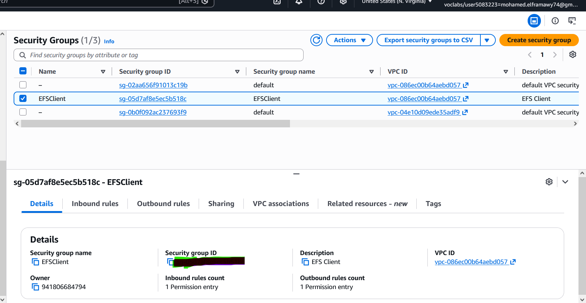
4. Chose **Create security group** and configured:
| Setting | Value |
|---|---|
| Security group name | `EFS Mount Target` |
| Description | `Inbound NFS access from EFS clients` |
| VPC | `Lab VPC` |
5. Under **Inbound rules**, chose **Add rule** and configured:

| Field | Value |
|---|---|
| Type | `NFS` |
| Source | Custom → paste the **EFSClient Security Group ID** |
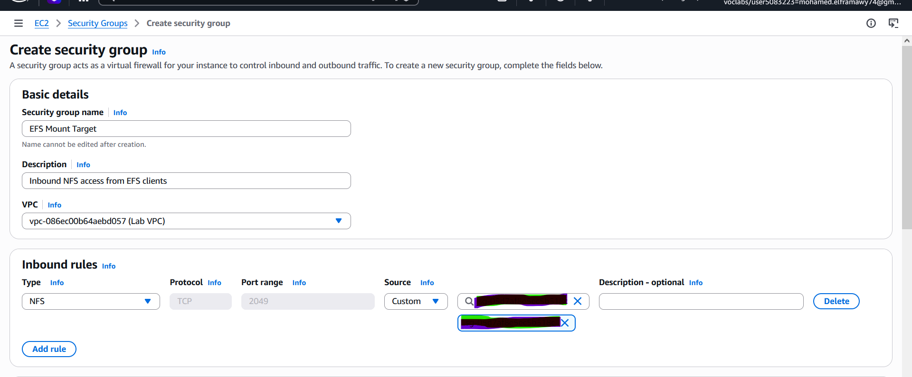
6. Chose **Create security group**
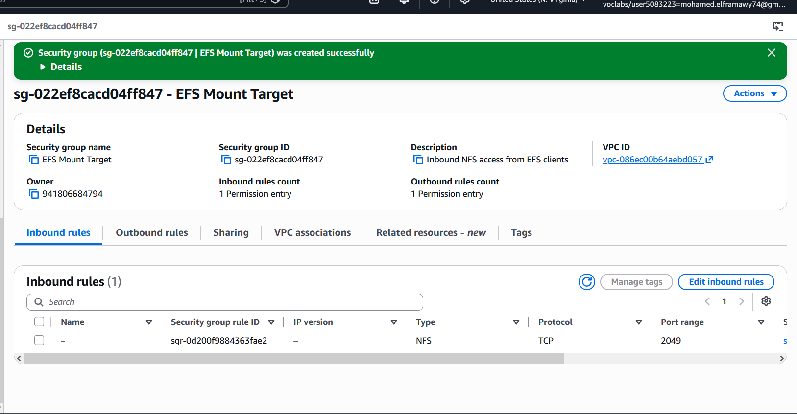

---

## 🗄️ Challenge 2 — EFS File System Creation

### Task 2: Creating an EFS File System

1. Opened the **AWS Management Console** and searched for **EFS**
2. Chose **Create file system**
3. In the **Create file system** window, chose **Customize**
4. On **Step 1** configured:
   - **Automatic backups:** ❌ Unchecked (disabled)
   - **Lifecycle management → Transition into IA:** `None`
   - Under **Tags**:
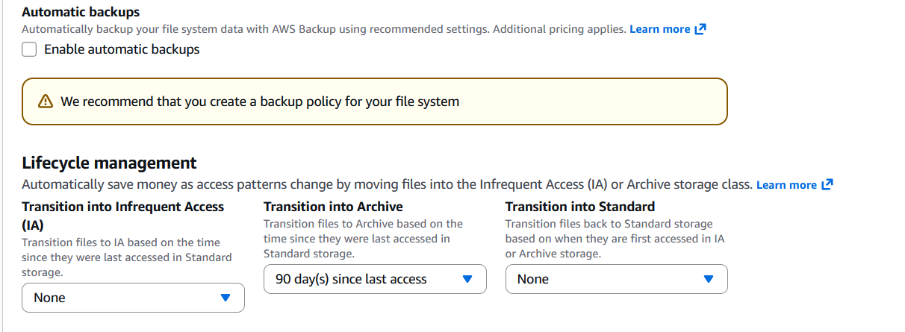
| Key | Value |
|---|---|
| Name | `My First EFS File System` |
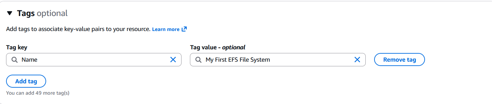
5. Chose **Next**
6. On **Step 2 (Network access):**
   - Set **VPC** to `Lab VPC`
   - For each Availability Zone mount target, **removed** the default security group (unchecked it)
   - **Attached** the `EFS Mount Target` security group to each Availability Zone mount target
7. Chose **Next** through **Step 3**
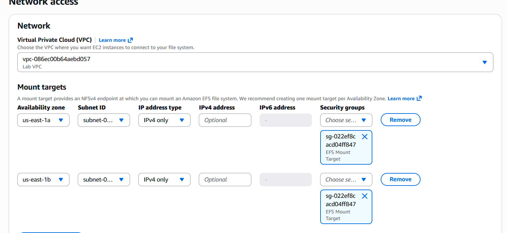
8. On **Step 4**, reviewed the configuration and chose **Create**
9. Waited until the **File system state** changed to `Available`
10. Waited a further 2–3 minutes until all **Mount target states** changed to `Available`
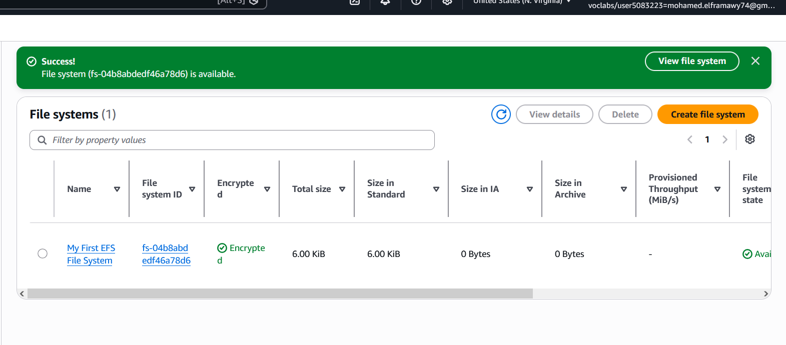

---

## 🖥️ Challenge 3 — Connecting to the EC2 Instance

### Task 3: Connecting via AWS Systems Manager Session Manager

1. From the top of the lab instructions page, chose **AWS Details**
2. Copied the value of **InstanceSessionURL**
3. Pasted the URL into a new browser tab
4. Successfully connected to the EC2 instance via **Session Manager** (no SSH keys needed)
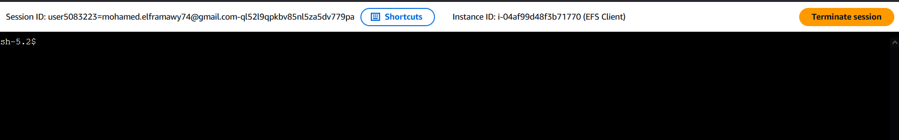

---

## 📂 Challenge 4 — Mounting the EFS File System

### Task 4: Creating a Directory and Mounting EFS

1. In the EC2 terminal session, switched to the `ec2-user` and installed the required utilities:
   ```bash
   sudo su -l ec2-user
   sudo yum install -y amazon-efs-utils
   ```

2. Created a directory to use as the EFS mount point:
   ```bash
   sudo mkdir efs
   ```
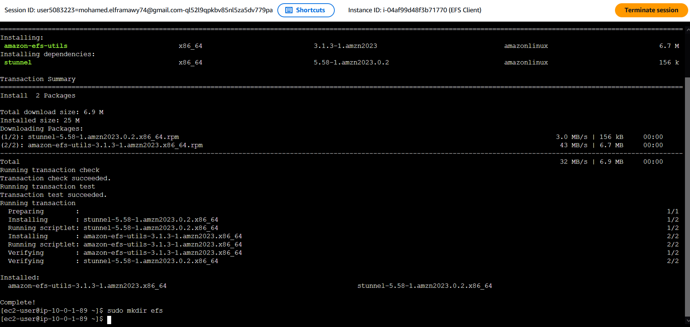

3. Went back to the **EFS console** and opened **My First EFS File System**

4. In the top-right corner, chose **Attach** to open the mount instructions
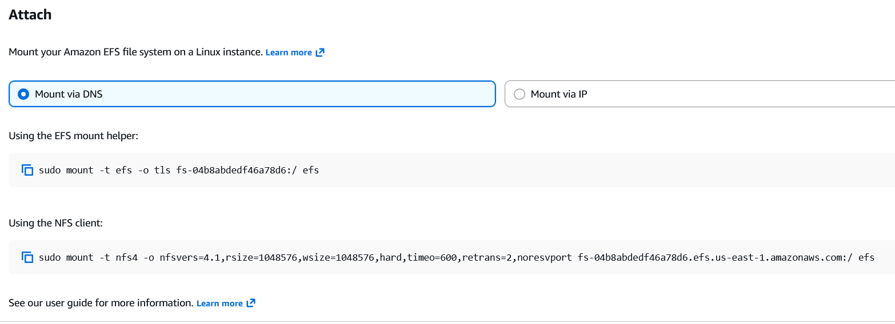
5. Copied the mount command from the **Using the NFS client** section and ran it in the terminal:
   ```bash
   sudo mount -t nfs4 -o nfsvers=4.1,rsize=1048576,wsize=1048576,hard,timeo=600,retrans=2,noresvport \
   fs-bce57914.efs.us-west-2.amazonaws.com:/ efs
   ```
   > ⚠️ The actual command uses your unique EFS DNS name — copy it from the console, don't type it manually.

6. Verified the mount was successful by checking disk space:
   ```bash
   sudo df -hT
   ```
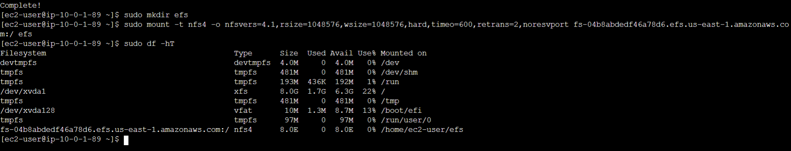
7. Confirmed the EFS file system appeared in the output with:

| Field | Value |
|---|---|
| Type | `nfs4` |
| Size | `8.0E` (virtually unlimited) |
| Use% | `0%` |
| Mount point | `/home/ec2-user/efs` |

---

## ⚡ Challenge 5 — Performance Benchmarking

### Task 5: Examining EFS Performance with Flexible IO (fio)

#### 5.1 — Running the fio Write Benchmark

1. Ran the following fio command to benchmark **write performance**:
   ```bash
   sudo fio --name=fio-efs \
     --filesize=10G \
     --filename=./efs/fio-efs-test.img \
     --bs=1M \
     --nrfiles=1 \
     --direct=1 \
     --sync=0 \
     --rw=write \
     --iodepth=200 \
     --ioengine=libaio
   ```
2. Waited a few minutes for the command to complete
3. Reviewed the **WRITE test summary** in the terminal output
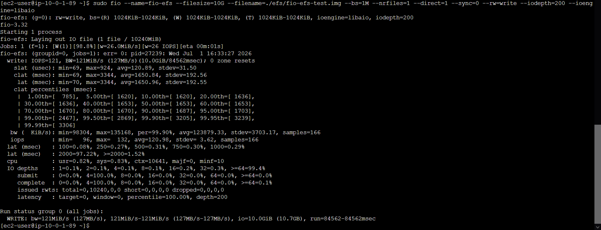

#### 5.2 — Monitoring Performance with Amazon CloudWatch

1. Opened **Amazon CloudWatch** from the AWS Management Console
2. In the left navigation pane, chose **All Metrics**
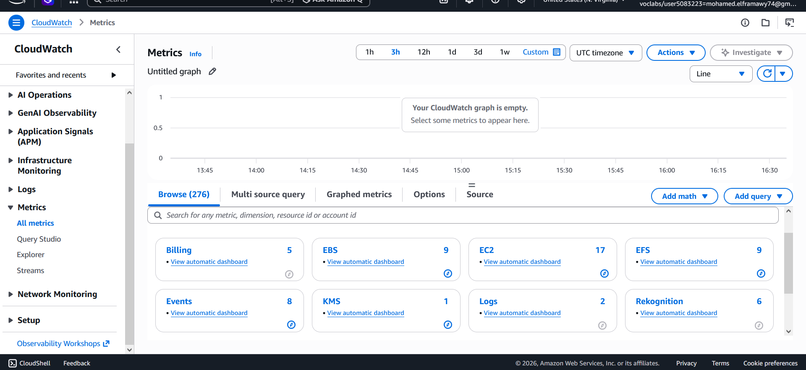
3. Chose **EFS** → **File System Metrics**
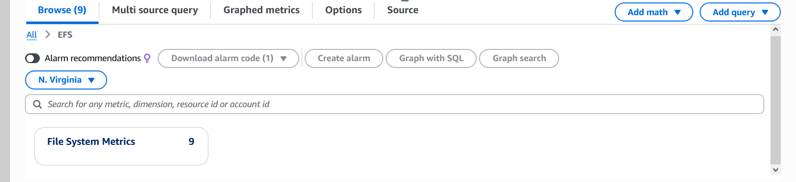
4. Selected the row with **PermittedThroughput** metric
   > 💡 Waited 2–3 minutes and refreshed if the metric wasn't visible yet
5. Adjusted the graph time range to **1h** to capture the fio test window
6. Noted the **Peak Throughput** on the Y-axis — approximately **3 GB/s**
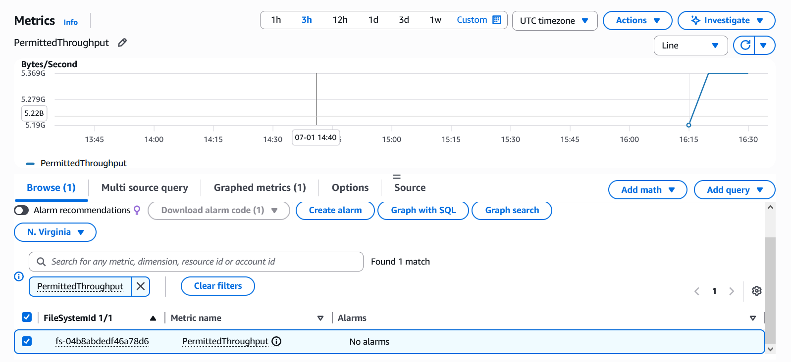
7. Unchecked **PermittedThroughput** and selected **DataWriteIOBytes**
8. Switched to the **Graphed metrics** tab and configured:

| Column | Setting |
|---|---|
| Statistics | `Sum` |
| Period | `1 Minute` |

9. Noted the **peak DataWriteIOBytes** value — approximately **7.6 GB**
10. Calculated write throughput:
    ```
    Write Throughput = Peak DataWriteIOBytes ÷ 60 seconds
                     ≈ 7.6 GB ÷ 60 ≈ ~126 MB/s
    ```
    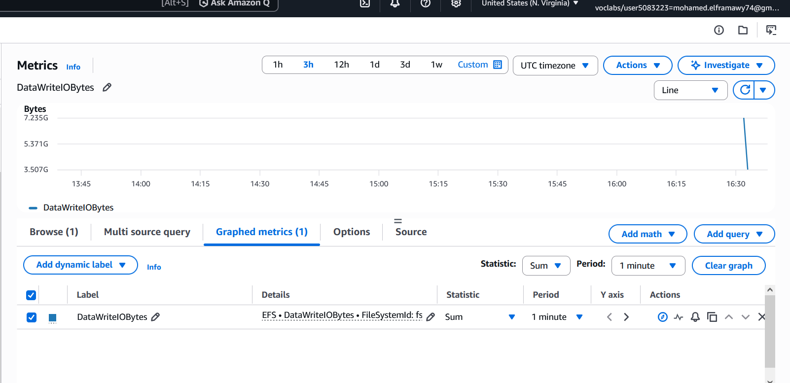

---

## 🧠 Key Concepts Demonstrated

| Concept | Detail |
|---|---|
| 🔒 NFS Security | Security group allowing TCP port 2049 inbound from EFSClient SG |
| 🗄️ EFS Availability | Mount targets deployed across multiple Availability Zones |
| 📂 NFS Protocol | Mounted using NFSv4.1 with optimized rsize/wsize (1 MB) |
| ⚡ Baseline Throughput | 50 MiB/s per TiB of storage |
| 🚀 Burst Throughput | Up to 100 MiB/s for all file systems; 100 MiB/s per TiB for >1 TB |
| 📊 Scaling | Throughput scales linearly and automatically as storage grows |
| 🔗 Shared Access | EFS throughput is shared across all connected EC2 instances |

---

## 📋 EFS vs EBS — Quick Comparison

| Feature | Amazon EFS | Amazon EBS |
|---|---|---|
| Protocol | NFS (NFSv4.1) | Block storage |
| Shared access | ✅ Multiple EC2 instances | ❌ Single EC2 instance |
| Scalability | Auto-scales (virtually unlimited) | Fixed size (manual resize) |
| Availability Zones | Multi-AZ | Single-AZ |
| Use case | Shared file storage, CMS, ML datasets | OS volumes, databases |

---

## 🏁 Result

An Amazon EFS file system was successfully created, secured, mounted to an EC2 instance using NFSv4.1, and benchmarked with fio. CloudWatch metrics confirmed the file system delivered expected burst throughput — demonstrating EFS's elastic, shared, and scalable nature for file-based workloads.

---

## 👨‍💻 Author
<div align="center">

> Made with ❤️ by [Mohamed el-faramawy](https://github.com/Muhammet-DEs)
---
⭐ *If you found this helpful, feel free to star the repo!*

</div>