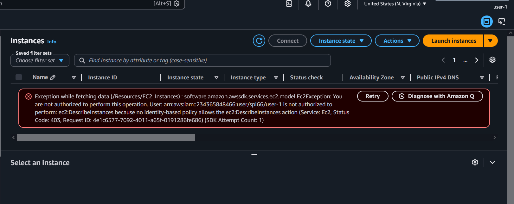
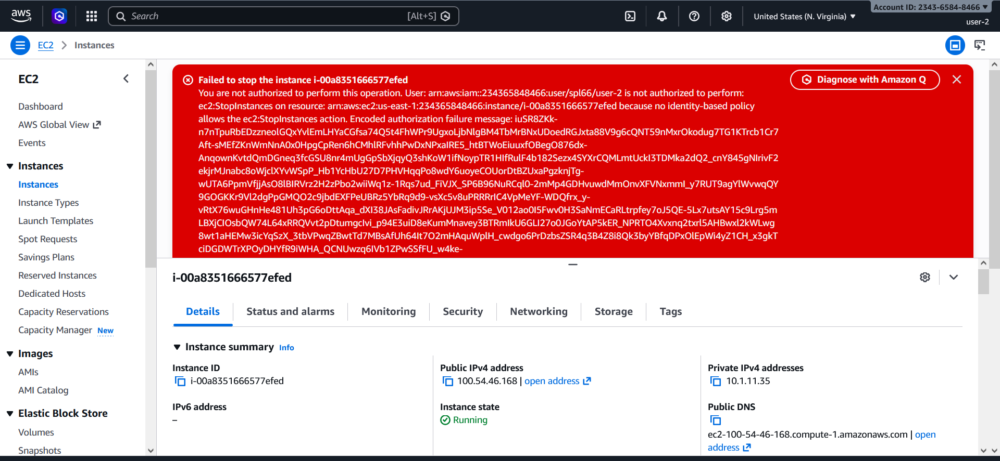
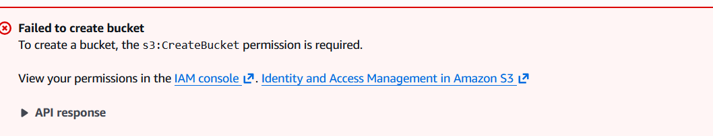
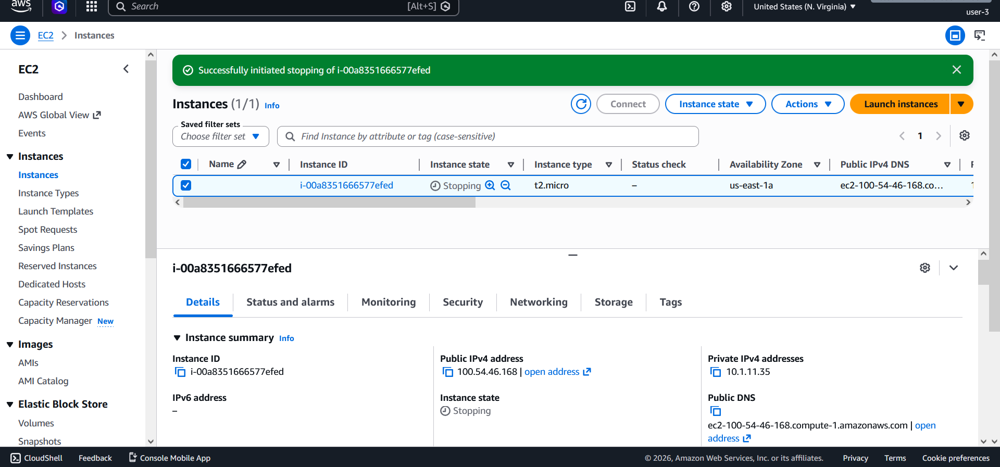

# 🔐 Lab: Exploring AWS Identity and Access Management (IAM)


---

## 📋 Overview

This lab explores **AWS Identity and Access Management (IAM)** — the service that controls who can do what in your AWS account. The lab covers inspecting pre-created users and groups, understanding attached policies, assigning users to groups based on job roles, and verifying permission boundaries through real-world testing.

> IAM enables you to securely control access to AWS services and resources. Using IAM, you can create and manage AWS users and groups, and use permissions to allow or deny their access to AWS resources.

---

## 🎯 Objectives

By the end of this lab, you will be able to:

- ✅ Explore pre-created IAM **users** and **groups**
- ✅ Inspect **IAM policies** applied to groups (Managed & Inline)
- ✅ Add users to groups following a **real-world business scenario**
- ✅ Locate and use the **IAM sign-in URL**
- ✅ Test and verify the **effects of policies** on AWS service access

---

---

## 🛠️ AWS Services Used

| Service | Purpose |
|---------|---------|
| 🔐 **AWS IAM** | Users, Groups, and Policy management |
| 💻 **Amazon EC2** | Permission testing target |
| 🪣 **Amazon S3** | Permission testing target |

---

## 👥 Business Scenario — Role Assignment

| 👤 User | 🏷️ Group | 📜 Policy | 🔑 Permissions |
|--------|---------|----------|--------------|
| `user-1` | S3-Support | AmazonS3ReadOnlyAccess | Read-only access to Amazon S3 |
| `user-2` | EC2-Support | AmazonEC2ReadOnlyAccess | Read-only access to Amazon EC2 |
| `user-3` | EC2-Admin | EC2-Admin-Policy (Inline) | View + Start + Stop EC2 instances |

---

## 📌 Lab Tasks

### Task 1 — 🔍 Explore Users, Groups & Policies

Navigated to **IAM → Users** and inspected all three pre-created users. Initially, none of them had any permissions or group memberships — only a Console password assigned under Security credentials.

Then explored the three pre-created groups and their attached policies:

| Group | Policy | Type | Permissions Granted |
|-------|--------|------|---------------------|
| `EC2-Support` | AmazonEC2ReadOnlyAccess | Managed | List & Describe EC2, ELB, CloudWatch, Auto Scaling |
| `S3-Support` | AmazonS3ReadOnlyAccess | Managed | Get & List all S3 resources |
| `EC2-Admin` | EC2-Admin-Policy | Inline | Describe, Start & Stop EC2 instances |

Reviewed each policy in **JSON format** — every policy statement follows this structure:

```json
{
  "Effect": "Allow",
  "Action": ["ec2:Describe*", "ec2:StartInstances", "ec2:StopInstances"],
  "Resource": "*"
}
```

> 💡 **Managed policies** are reusable and instantly apply updates to all attached entities. **Inline policies** are tied to a single user or group for specific one-off permissions.

---

### Task 2 — 🔗 Add Users to Groups

Added each user to their corresponding group based on their job role:

**user-1 → S3-Support:**
- Go to **IAM → User groups → S3-Support → Users tab**
- Click **Add users** → select `user-1` → confirm

**user-2 → EC2-Support:**
- Go to **IAM → User groups → EC2-Support → Users tab**
- Click **Add users** → select `user-2` → confirm

**user-3 → EC2-Admin:**
- Go to **IAM → User groups → EC2-Admin → Users tab**
- Click **Add users** → select `user-3` → confirm

After all assignments, each group shows **1** in the Users column ✅

---

### Task 3 — 🔐 Sign In & Test User Permissions

**IAM Sign-In URL** (found in IAM → Dashboard):
```
https://<account-id>.signin.aws.amazon.com/console
```

Opened a **Private / Incognito** browser and tested each user separately.

---

**user-1 — S3 Support** (`Lab-Password1`)

| Service | Action | Result |
|---------|--------|--------|
| Amazon S3 | List & Browse Buckets | ✅ Allowed |
| Amazon EC2 | View Instances | ❌ Not Authorized |

> user-1 inherits read-only S3 access via the S3-Support group — EC2 is fully blocked.

---

**user-2 — EC2 Support** (`Lab-Password2`)

| Service | Action | Result |
|---------|--------|--------|
| Amazon EC2 | View Instances | ✅ Allowed |
| Amazon EC2 | Stop Instance | ❌ Not Authorized |
| Amazon S3 | List Buckets | ❌ Not Authorized |

> user-2 can view EC2 resources but cannot modify them — zero S3 access.


---

**user-3 — EC2 Admin** (`Lab-Password3`)

| Service | Action | Result |
|---------|--------|--------|
| Amazon EC2 | View Instances | ✅ Allowed |
| Amazon EC2 | Stop Instance | ✅ Allowed |
| Amazon EC2 | Start Instance | ✅ Allowed |

> user-3 successfully stopped the instance — state changed to `Stopping` ✅

---

## 💡 Key Concepts Learned

| Concept | Description |
|---------|-------------|
| 🔐 **Principle of Least Privilege** | Users only receive the minimum permissions required for their role |
| 👥 **Group-Based Access** | Assigning policies to groups is more scalable than per-user assignment |
| 📜 **Managed vs Inline Policies** | Managed = reusable across entities; Inline = specific to one entity |
| 🧪 **Permission Testing** | Always verify policies work as intended by signing in as the actual user |
| 🔗 **IAM Sign-In URL** | Account-specific URL used for non-root IAM user access |

---

## 📚 References

- [AWS IAM Documentation](https://docs.aws.amazon.com/iam/)
- [IAM Best Practices](https://docs.aws.amazon.com/IAM/latest/UserGuide/best-practices.html)
- [AWS Managed Policies Reference](https://docs.aws.amazon.com/aws-managed-policy/latest/reference/policy-list.html)
- [IAM Policy JSON Reference](https://docs.aws.amazon.com/IAM/latest/UserGuide/reference_policies_elements.html)

---

## 👨‍💻 Author
<div align="center">

> Made with ❤️ by [Mohamed el-faramawy](https://github.com/Muhammet-DEs)
---
⭐ *If you found this helpful, feel free to star the repo!*

</div>